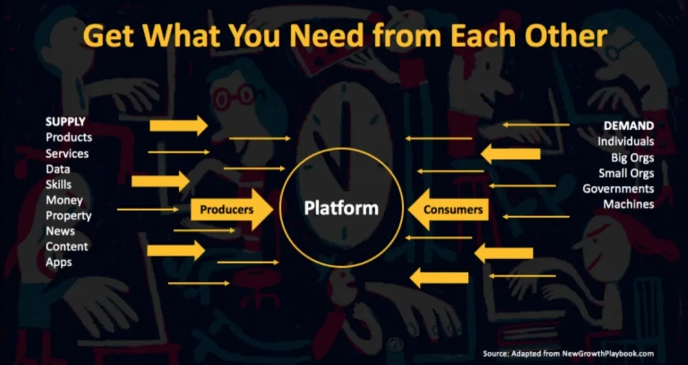
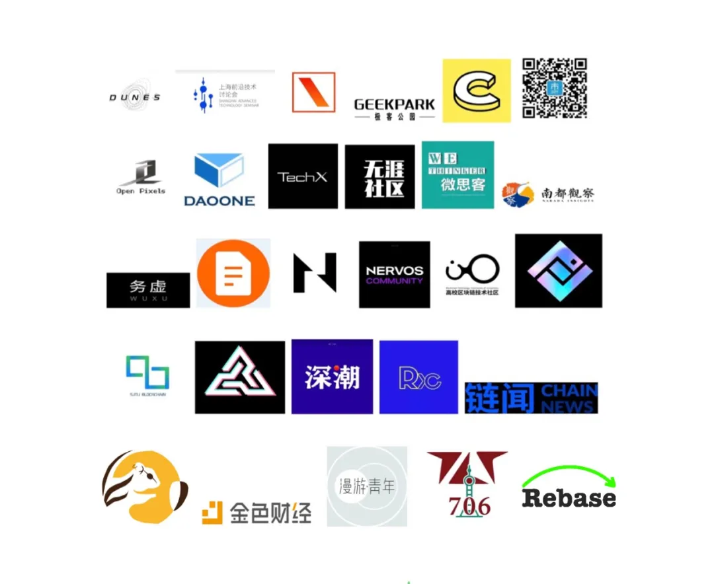

数据社会正在向我们铺开，在享受技术舒适便捷的同时，数据安全和算法却在深入地介入每个人的生活。当新技术开始异化用户和平台的信任，人人都面对着隐私风险和不平衡劳工经济的同时，却也是思考我们的工作、生活与数据社会联结面的恰当契机。

当人和平台都困在算法里，不管是外卖员、滴滴司机、数据标注工厂里的工人还是用户都只是产品增长数据测试中的一个数据点，而广告也似乎成了大多数科技公司的唯一盈利方式（百度、微博、知乎、今日头条等等），内容和搜索产品受此影响而质量下降，技术未来会为此受到阻碍吗？

从报纸、图片、视频，到未来的脑机接口，更丰富，更高维度的信息真的是我们想要的吗？我们关注的科技新节点是希望还是泡沫？新的网络交互生态和媒介传播可以解决这个问题吗？技术进步=高枕无忧？

对于身处数据社会面中的个体而言，隐私保护、算法推送、广告宣传或许不再如我们所想在切身关注用户/平台的利益。在个体被卷入数据编码和算法节点的数字化社会中，寻找未来数字媒体的可能性方向，预测数据的前景是否能真正进步成为一个新的命题。

数据社会的未来，迟滞还是发展？

为进一步探索数据社会的现状和未来，706 将围绕“数据的社会面”，开展三期线上沙龙主题活动，三次活动的主题分别是「算法困局」、「隐私追踪」与「未来媒体」。

#算法困局 | 平台经济当下，算法如何重新定义工作？

#隐私追踪 | 面对渐行渐远的隐私，用户的话语权在哪里？

#未来媒体 | 信息爆炸的今天，我们该如何想象明天的数字媒体？

我们邀请了一线 IT 从业人员、传播学研究员、科技策展人、算法工程师等拥有各色数据社会经历的嘉宾就三个主题进行深入讨论，活动过程中也设置了观众与嘉宾的互动环节，欢迎大家积极参与 ！

## 01 平台经济当下，算法如何重新定义工作 ?

活动时间：2021 年 6 月 12 日 周六 上午 10：00（北京时间）

活动嘉宾：姚翔（主持）、熊节、邱林川、Strayn

ABOUT

由算法和数据分析导致的产品变化对于在产品上提供服务的“零工们”，外卖员、滴滴司机，有什么具体的影响? 他们是否对算法和产品的变化有了解，有没有相应的措施应对？

现在广告似乎成了大多数科技公司的唯一盈利方式（百度、微博、知乎、今日头条等等），科技公司是分析数据并做出决策的/机器学习算法的迭代机制是什么？

平台由于盈利压力，将成本如何转嫁到了零工这一方？

主持人

姚翔

姚翔，区块链研究员、社区建设者。现为上海前沿技术研讨会发起人，以太坊社区联合体togETHer共建人。专注于数字身份、区块链安全和隐私、科技考古等行业基础问题研究。他还著有区块链相关论文专著数篇，是中国大陆首位Corda 认证工程师。

嘉宾:

<!--  -->

熊节，四川质量发展研究院资深顾问，拥有超过二十年 IT 行业的从业经验，在金融、政府、电信、物流等行业的信息化建设方面有着丰富经验。曾参与指导华为、壳牌石油等多家企业的数字化转型工作。译有《重构》、《实现模式》、《控制论革命者》等著作。

邱林川，新加坡国立大学传播与新媒体系教授，曾任香港中文大学新闻与传播学院教授。主要研究信息传播技术、阶级、全球化及社会变迁。著有《新媒体事件研究》、《信息时代的世界工厂：新工人阶级的网络社会》、《再见 iSlave：数码废奴宣言》等。

Strayn，Eightfold AI 数据科学家，706 硅谷联合创始人，负责工业级人才匹配算法模型及企业级数据平台的开发工作，主导机会公平模型去偏见等项目。关注技术伦理、科学哲学与社会发展和个体生存状况之间的关系，曾发起《技术的社会面》、《空间、记忆和语境》、《迈向星空》系列沙龙。

## 02 面对渐行渐远的隐私，用户的话语权在哪里？

活动时间：2021 年 6 月 20 日 周日上午 10：00（北京时间）

活动嘉宾：胡晓宇（主持）、林桉、罗勉、Katt Gu

ABOUT

宏观、形而上的讨论线上隐私为何重要，隐私与便捷、隐私与安全的必须二选一吗？

对于用户而言，刷网页和APP时，有多少个人数据被记录了，是以什么形式被收集的？

数据被记录之后普遍有哪一些用途：广告，直接售卖交易给第三方，算法推荐？

苹果、谷歌等互联网大头公司在作出什么样的努力来应对用户隐私被大规模追踪的问题？

主持人

胡晓宇

胡晓宇，从事软件工程工作，业余热爱研究数字权益、人工智能、计算机与社会等话题。曾参与706多项活动如翻译组等等。

嘉宾:

林桉，算法工程师，18 年至今，从事广告、内容、视频推荐系统的算法模型工作，有部分 NLP、反欺诈项目经验，曾在数据降维、多模型融合、多模态数据分类上有深度研究。

罗勉，706 创始团队成员，斯坦福大学政治经济学博士候选人，曾在北京大学和台湾大学学习政治与国际关系。

Katt Gu，伊利诺伊大学香槟分校（UIUC）法学博士、信息学博士在读；主要研究方向是比较法，以及区块链、数据隐私等创新领域的法律监管等问题。Anti 舅舅流协议起草人。

## 03 信息爆炸的今天，我们该如何想象明天的数字媒体？

活动时间：活动时间：2021 年 6 月 27 日 周日 晚上 20：00（北京时间）

活动嘉宾：活动嘉宾：韦南昕（主持）、龙星如、知县、孙萍

ABOUT

从报纸，到图片，到视频，到未来的脑机接口，更丰富，更高维度的信息真的让我们看到这个世界更多的美了吗？

技术的进步对媒体说是真正的进步吗? 信息的多维爆炸增长，人人都是专家，虚假信息的传播，少数群体的消声，收费混乱的科技媒体平台，亚文化的传播面对更严重商业艺术的挤压？

主持人

韦南昕

Blaine，前IT咨询从业者，博士毕业于伦敦帝国理工复杂性科学中心，现居英国，主业研究统计物理/复杂系统建模，关注科技社会之耦合与人类未来，日常考虑转行哲学。

嘉宾:

<!--  -->

龙星如，策展人，写作者，中央美术学院科技艺术方向研究员, 英国皇家艺术学院艺术评论硕士，清华大学新闻传播学士。研究方向为普适运算与数据充斥的时代语境下，艺术创作与数据环境及技术的关系。在中央美术学院开设数据艺术课程。策划展览包括《撒谎的索菲亚和嘲讽的艾莉克莎》（Hyundai Blue Prize 策展人奖）

孙萍，香港中文大学博士，现就就职于中国社科院新闻与传播研究所，主要研究方向是平台经济和数字劳动、信息与传播技术、技术与性别、新媒体与社会。《外卖骑手，困在系统里》论文引述作者。

知县，北京大学计算机本硕，产品经理，连续创业者，在支付、游戏、流量领域有较深的行业经验。17 年进入区块链行业，目前在降低用户门槛和丰富应用场景的方向上努力，希望让更多用户进入 web 3 生态。

## 04 特别场次：706 客厅沙龙

这最后一场不同于前面 3 场固定的嘉宾分享和对谈，这最后一场我们预计 7 月初，会在北上深圳，杭州，成都，南京等城市举行线下的客厅对话，主题还是延续上面的 3 场系列沙龙，不过更多是希望所有活动参与人员可以自我表达，聊聊自己所经历的和数据隐私，平台经济，数字媒体相关的一些故事，感触或者观点。

如果你希望在你所在的城市（不局限于上面所列城市）发起“数据的社会面”主题相关的 706 客厅对话，请在麦克报名表单里面相应的选项填写清楚就可以，本场次目前只是各个城市的线下活动召集人报名，目前还不接受观众报名，只是在这里预热下，我们在在这个系列沙龙结束后，撰写新的文案进行报名。

如果你有其他疑问或合作咨询，欢迎联系 706 小管家（微信 xiaoguanjia706）

报名方式及费用 SPRING

活动形式

本次系列活动为线上沙龙， 都会通过腾讯会议进行，我们会到时候通过微信群的方式通知活动报名人员，腾讯会议号码。

活动报名

点击“阅读原文”完成报名，报名后麦克表单会跳出一个活动群，直接扫码加入即可；

如无法入群，请联系706小管家。

活动通票 | RMB45（3场）

上传朋友圈分享截图，享受8折优惠；若集满50个好友点赞，享受全场免费资格。706八周年众筹成员或706共建人或706新老志愿者皆可免费参加。

* 为了方便拉群和后续社群运营，本系列活动不再提供单次活动，只提供通票报名；

* 如果你因为特殊原因只能参加其中一场或二场，也可以单独咨询沟通，购买通票后，我们再根据你参与的实际场次退还部分费用；

活动咨询

如果你在活动报名过程或参与过程中，遇到任何问题，可以联系下面的微信咨询。

主办方 sponsor

706机器学习小组

706孵化的项目，是一个基于706北美沙龙聚集起来的网络小组，成员多是机器学习相关专业的从业者，研究者，博士……大多都是社会科学、计算机、人工智能、大数据背景，关注前沿技术理论和议题。

706青年空间

706 青年空间起源于宇宙中心五道口，是中国第一家青年空间，试图创造一种新型的实体空间形态，目前已在全国数个城市共创了数十个 706 据点，同时也孵化了具有潜力的合伙人项目。

706 通过社群运作模式，倡导一种新的生活方式，倡导新型的教育，旅行，居住和社交理念，让青年人探索生活的更多可能性。

策划人

JC，伯克利数学和经济本科，现就职于位于旧金山的经济咨询公司，从事反垄断、金融监管等领域商业案件的数据分析工作

 
RXY，伯克利计算机和统计专业，之前做过强化学习和机器人方向的科研，现在在硅谷谷歌做数据仓库，数据流方向的软件工程师。

联合传播：
united media and community

