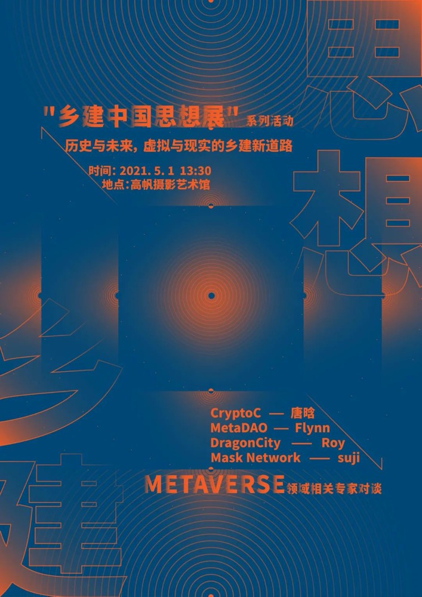

时间 ：2021 年 5 月 1 日

地点：杭州高帆摄影艺术馆

主持人：黄孙权

 
与会嘉宾

MetaDAO 发起人——Flynn

CryptoC 创始人，碳链价值 前主编——唐晗

Dimension&Mask Network 创始人及 CEO，前 Qdaily&财新传媒 独立记者

RadicalxChange 基金会导师——Suji Yan

艺术家，“网页里的电脑博物馆” 创始人——周蓬岸

MetaverseLabs 创始人，Godel Labs 创始人兼 CEO——Roy

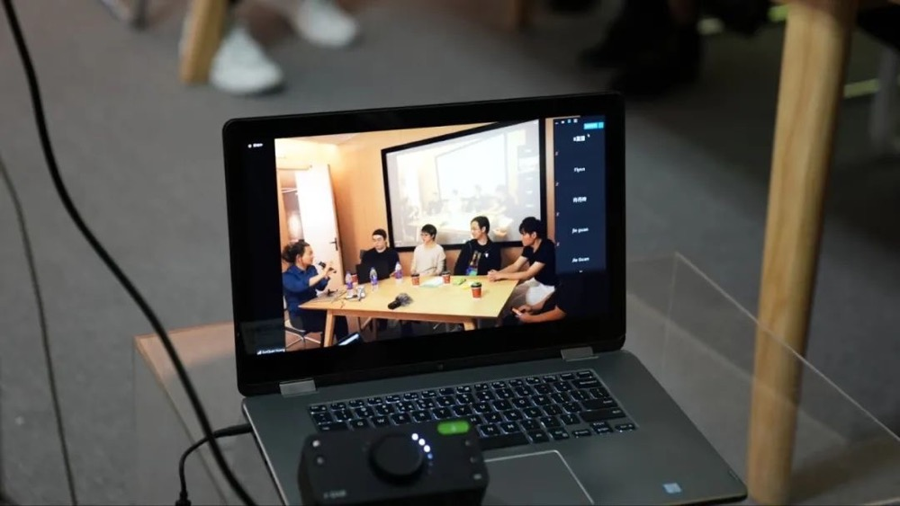

-活动回顾

Flynn：

大家好，我是 Flynn，很荣幸能够跟在场的各位一起讨论今天的话题。我是幻境实验室（Metaverse）的开发者，也是 MetaDAO 小组的发起者。今天我分享的主题是“元宇宙以及我们的探索”。

首先，我们 MetaDAO 小组很荣幸可以在这次“<a _blank href="https://mp.weixin.qq.com/s?__biz=MzI0MzQzNTczMA==&mid=2247487169&idx=1&sn=49c250bea74bb4ab9344e9286d324564&chksm=e96c5f7cde1bd66aebefb5ea331f4ebd89f1da96b69bc80ef109525c3e6c2e8d4f506e2a8c89&scene=21#wechat_redirect" style="color:#ff6827">乡建中国思想展</a>”中和黄教授带领的空间生产与乡土实践研究组共同在 Decentraland 这样一个去中心化的虚拟空间中，对民国时期的重庆北碚进行复原和再创作。我觉得还挺有意思的。我们把这次线下展厅中的相关展品放在了北碚虚拟空间中，然后在线上举办了一个为期一个月的展览。在展厅的门口，我们放置了一块大屏幕，来直播这次乡建中国实践者大会，还有今天的讨论会。同时，我们还在北碚中开辟了一条空中路线，玩家可以乘坐飞机在天空中鸟瞰北碚，用现实中很难实现的角度来去体验城市。

去年，我们也曾经参加了黄教授所带领的网络社会研究所组织的一次“网状网络工作坊”，在国美校园中利用开发板构建了 20 多个节点，组成一个网状网络。在这个网络中有很多应用。其中之一就是我们 MetaDAO 小组利用三天时间搭建的一个第五届网络社会年会的一个展厅。我们基于的是 Decentraland 平台，它是开源且十分便捷的部署方式。即便不接入互联网，我们也可以把平台的开发工具所搭建的场景部署在网上网络之中，然后连入。网络用户不需要下载任何软件，只需要通过电脑浏览器就可以进入虚拟空间中，然后使用。同时，大家也可以在这个场景里看到进入场景的其他的玩家。也就是说，它是一个实时的，多元交互的场景。

接下来，我会给大家分享一些关于 Metaverse 事情。如果大家有了解过 Metaverse 的概念，可能都会认为这个词最早是由尼尔.史蒂文森（Neal Stephenson）在 1992 年科幻小说《雪崩》中创造的。人类在这个世界里，通过软件代理，使用化身在虚拟三维世界中生活，并且能够通过现实世界的映射在虚拟世界中进行交互。我们在一些影视作品中也可以看到一些 Metaverse 的影子，比如《黑客帝国》、《创战纪》，还有《头号玩家》，《刀剑神域》等等。

关于 Metaverse，其实大家现在还没有一个很清晰的概念，而我会从我个人的角度尝试进行一些“比较”，来解释这个概念。首先，我会比较“赛博空间”和“元宇宙”。今天的大家已经随时随地地使用互联网工作生活和娱乐了。可以说，我们已经身处赛博空间之中。区别于“信息交换”，在我们时代，我们在 Metaverse 中会更强调身体感受、物理感受，还有现实的一些融合。举个例子：我们现在会经常使用微信沟通，大家会采用文字语音或者视频；但其实，随着 VR 技术的发展，我们可以拥有一个虚拟的化身，在虚拟空间中和对方进行一些更加沉浸的交互体验。

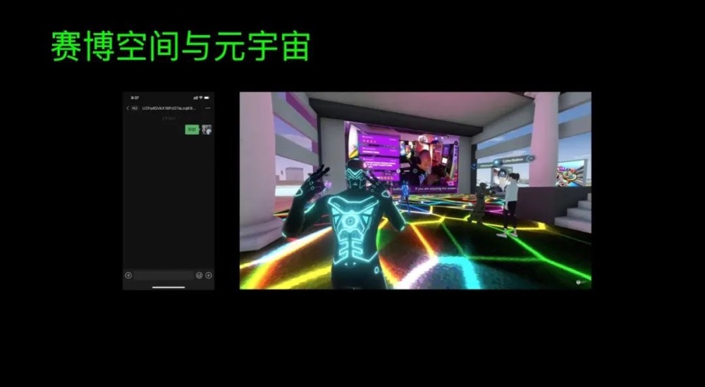

虚拟世界广场（图片取自Flynn演讲ppt）

上图是现有另外一个虚拟世界。我第一次进入到这个虚拟世界时带着 VR 眼镜，广场上已经聚集了几个国外的朋友，他们看到我时会用实时语音和我打招呼，甚至还可以对我招手。“招手”这个动作就是线下世界采用了带有身体追踪功能设备的用户用真实身体所发出的动作进行映射的结果，很像 VRChat。但即使是当下最好的 VR 眼镜，也没办法被连续使用超过半小时。

下一个比较是“游戏”和“开放世界”。游戏其实始终是和 Metaverse 深度纠缠在一起的。游戏往往会指向一个目标，比如说具体的“输赢”，或者一个有始有终的剧情。但在现在，我们会看到有一些开放世界这样的游戏，它们有各种特殊的玩法，并且永不终结。玩家在这样一个模拟世界中其实不需要体验全部的内容，他们只需要选择自己喜欢的玩法玩下去。这些游戏往往会有一个比较完善的世界观或运营系统，比如像“我的世界”“元神”，还有“赛博朋克 2077”等等。我们可以把这样的开放世界看成一个扩大的游戏。

这样的开放世界它的核心其实还是游戏体验；但是，从去年的疫情开始，游戏之外的很多线下活动——例如工作、教育、展览、演出等，不得不由线下转为线上，在赛博空间中进行展开。我们可以看到，一些游戏已经开始承载游戏之外的活动——比如"堡垒之夜"举办了线上演唱会（这个线上演唱会吸引了超过 1000 万的用户在游戏空间中观看）。除此之外，一些学校也开始在线上的空间进行校园场景的搭建，比如，他们会在“我的世界”里进行毕业典礼。

同时，我们也发现，除了这些大型机构举办的大型现场活动以外，很少被关注到的一些小团队其实也正在搭建虚拟空间，并且在里面举办活动。我从去年开始了解到，一些线下演出空间也尝试在线上空间进行演出，但是最终的结局是失败的。有些活动是线下线上同时举办，但线下场地很火爆，线上空间几乎无人问津。这些空间依靠的其实不是像游戏这样已经有一定流量的虚拟空间，而是，它们本身就是一个独立且脆弱的空间，遍布于一个个独立网站之中。这些独立的空间生命周期其实就是活动本身的生命周期，空间诞生之日起，空间就开始要承载这项活动，而活动结束时，空间本身也就失去了使用价值。

我们也许缺少一个开放的公共虚拟空间。在公共空间里，有人会去开发游戏，有人进行线上演出，有人去举办展览；而如果我们能够把这些小空间连接在一起，形成一个相对公共的虚拟空间，那么，公共空间的生命周期就会远大于某一个活动的生命周期了。同时，公共空间随着时间所聚集的流量，也可以被更好地转化到每一个活动中——这其实就是我们在龙城所做的一些事情。

我最初接触龙城是在 2017 年。当时，我在 Decentraland 拍下一些私人土地后将部分土地捐给了包括龙城在内的一些公共小区。随后，Decentraland 一直被慢慢开发，直到 2019 年，虚拟世界开始允许个人的土地开发，于是我和一个好友一起开始研究虚拟世界。在 2020 年疫情期间，我们开始拥有大量时间做开发，于是，我们用三天的时间制作了一个虚拟歌手，以这个虚拟歌手为主题搭建了一个 club，并把虚拟歌手的歌曲放进 club 供来访者收听。当时，我们没有做任何宣传，也没有正式运营，只是放置了一个以太坊捐款箱；但我们在捐款箱被放置之后的两天之内就收到了三笔捐款。

虚拟歌手TAVA及其Club（图片取自Flynn演讲ppt）

后来，因为当时场景的日活很少，中国社区中有一些人就开始组织类似旅行团的活动。大家会在周五聚在一起，找一些好景点去打卡；当时，我也参加了这样的一个活动，旅行团内的一个导游发现我在建设场景，我们就陆续结识到社区里更多的人，包括龙城的城主，于是就开始一起规划龙城的建设——我的身份就是这样从一个小区的捐赠者变成了一个建设者。

龙城所在的地块，其实是由上百名 Decentraland 虚拟世界的社区成员在第一次土地拍卖中进行土地捐赠创立而成的。它总共一共有 6485 块地，每块地有 16×16，总面积大概是 166 万方。龙城是一个基于区块链的虚拟城市，致力于探索有关人类社会未来发展的更多可能性。传统中对于历史的理解是基于线性时间的，但是在龙城的世界架构中，我们希望能抛开这些，创造一个过去和现在共存的三维空间，甚至多维世界。龙城会更加强调“包容性”和“开放性”。我们不会以宗教、种族、国家、性别或者阶级来区分个人；每个人都可以以任意形式的虚拟化身成为自己，进入龙城并受到欢迎。去年 7 月份，龙城的第一个场景正式上线，随后我们就开始频繁举办一些活动。

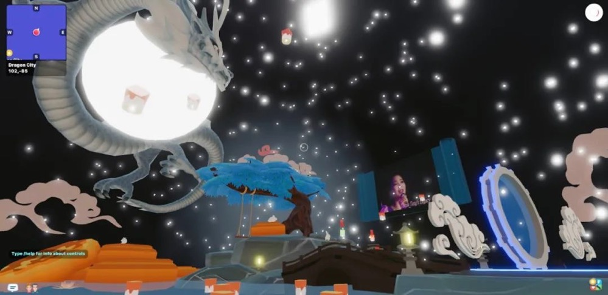

龙城中秋活动（图片取自Flynn演讲ppt）

上图是我们去年中秋时的节日庆祝。在这个场景里，大家可以放花灯，许愿，还可以去听邓丽君的一些歌。

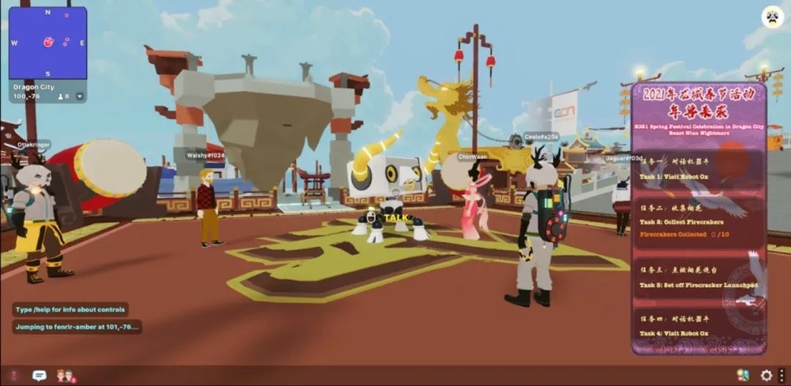

MetaDAO成员个人作品（图片取自Flynn演讲ppt）

这是我们做的一个展览，也是我们一位成员的个人作品。作品原本是以视频的形式展现的，但我们把它复原成一个 3D 场景，让玩家进入场景，更沉浸式地体验这则赛博故事。

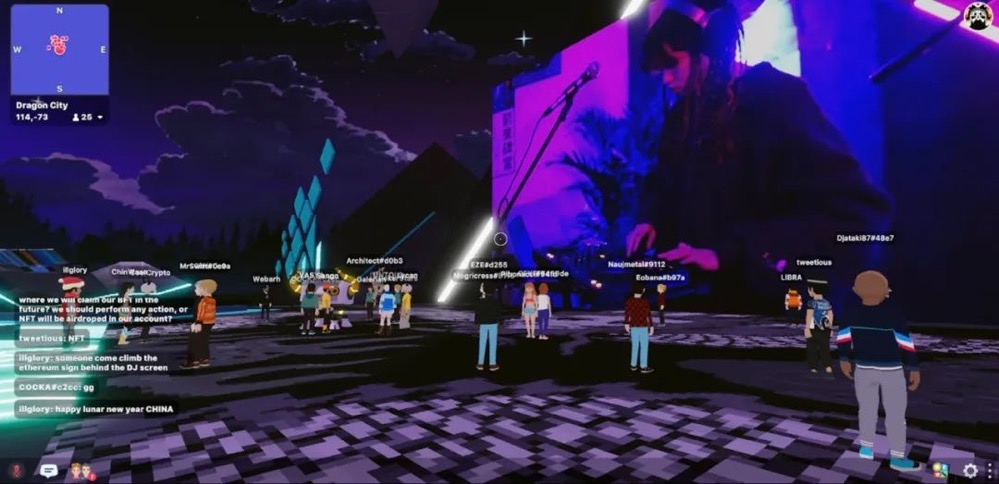

龙城2021年春节活动（图片取自Flynn演讲ppt）

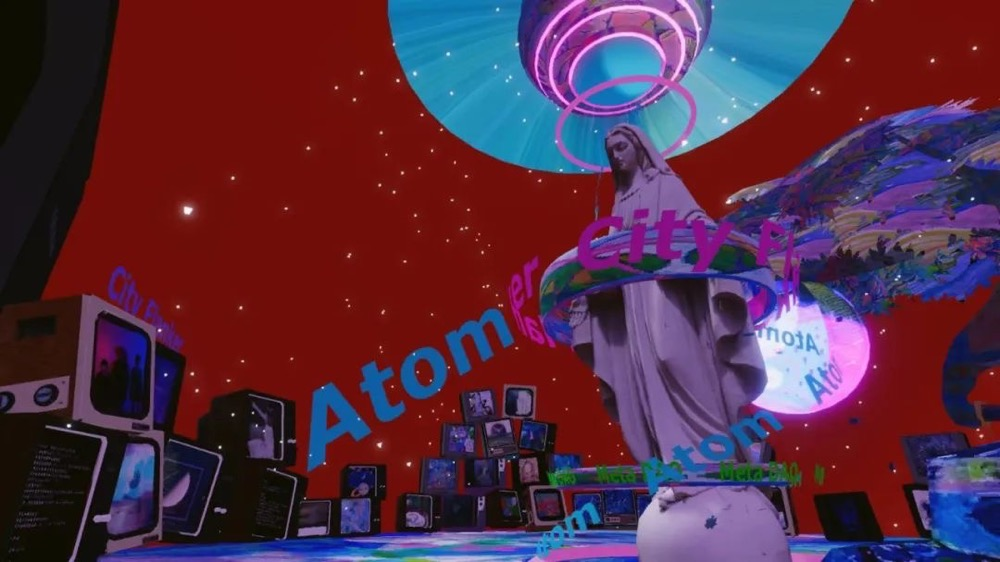

City Flanker乐队演出现场（图片来自Flynn）

这是我们当时和杭州的一个乐队进行了一个线上线下的虚拟演出。我们专门为乐队搭建了一个场景，还有一个伙伴把他自己的一些作品摆在里面，进行展览。

其实在这次讨论会之前，我和一些朋友，包括龙城城主 Roy，都没有见过面。我们团队中也有很多我迄今为止都没见过面的成员——我们正是通过虚拟世界把各位连接在一起；从建设工作到举办活动，我们大部分的工作都完全在赛博空间内完成。

我们去年在“幻境实验室”的支持下成立了 MetaDAO 小组。这个小组是由密码朋克艺术家、建筑师、程序员、区块链爱好者和游戏爱好者自发组成的。“幻境小组”的组建基于的是我们对网络独立宣言，开源文化和密码朋克思想所进行的一些延伸。我们希望对“虚拟世界和现实世界的交织”进行探索，并通过实验和作品阐释我们对这个主题的理解。我们希望能吸引到一些关于对 Metaverse 有兴趣的伙伴进行交流和探讨。从这次北碚的项目，到之前对网状网络的探索，都是我们以小组形式完成的。作为这个时代的一份子，我们希望自己能对即将到来的虚拟世界做出一些贡献。

目前，我们主要的研究方案有 4 个——虚拟空间数字建造，虚拟交互数字互动，虚拟生物数字孵化，以及虚拟文物数字创作。除此之外，我们也持续关注着我们世界的一些基础设施建设。一番探索后，我们越发意识到，其实现在的 Metaverse 世界还处在非常早期的阶段。确实，在现阶段，区块链使我们能够互通数字身份和虚拟资产，这是很大的进展；但是，我们对 Metaverse 世界本身的一些标准和协议的探索其实才刚刚开始。甚至于，很多想法现在大家都还没有产生，比如，我们很难想象，如果没有 html 这样标准的互联网会是什么样子？同时，现在的虚拟世界也还存在着很多的问题，比如土地稀缺导致的地价暴涨带来开发成本过高；还有不同虚拟世界之间互通性的缺乏等等......这些问题都需要我们从事 Metaverse 的实践者一起努力解决。最后，我想引用玩具总动员里巴斯光年的一句台词作结—— “To Infinity and Beyond” 。

谢谢大家。

---

黄孙权：

非常感谢 MetaDAO 小组！我觉得这和我早期的经验大有不同。我在 2014 年或 2015 年邀请唐凤和我们的学生一起做了一场工作坊。这个工作坊联合了我在杭州和当时在高雄上课的大学。当时我们用的还是非常复杂的设备和“High Fidelity”平台，进去以后看到一些不成人形的人，讲几句话，就觉得很感动。现在看起来，2014 年 2015 年的技术还是比现在的技术差很多。

我们当时在杭州的教室做了一个 model，在高雄的教室也做了一个 model。高雄的学生可以穿过一个门到达杭州的教室听唐凤在讲课。就是这样简单的东西，让我从那时开始觉得“虚拟世界”好像是很有可能的。我们也把高雄的一个眷村建了模，给一个老先生做了 3D 扫描。我们把这个老先生放在 High Fidelity 里头，又录了一段他在模型中行走和说话的声音。他就在建筑物里等着，所有人进到模型里就可以跟着这个老先生走，他会告诉大家这个房子以前是干嘛的？这台钢琴是干嘛的？之类的。

我们做得其实非常 rough，因为我们主要是尝试在虚拟空间做一个导览的机器。当时我们用的技术都还不太成熟；但这两年，我从你们身上学到非常多各种新的东西和看法，这也激起了我的兴趣。在我们现有的新技术和新界面的基础上，怎样才能和更广泛的社会阶层、和各种各样的人来共构一个可以被共享的世界？否则，虽然我们的世界其实看起来无限宽广，但它其实就非常受限。对吧？这也是我希望待会儿能展开来谈一谈的一个话题。

现在我们先请 CryptoC 的唐晗来分享一下他们的经验。

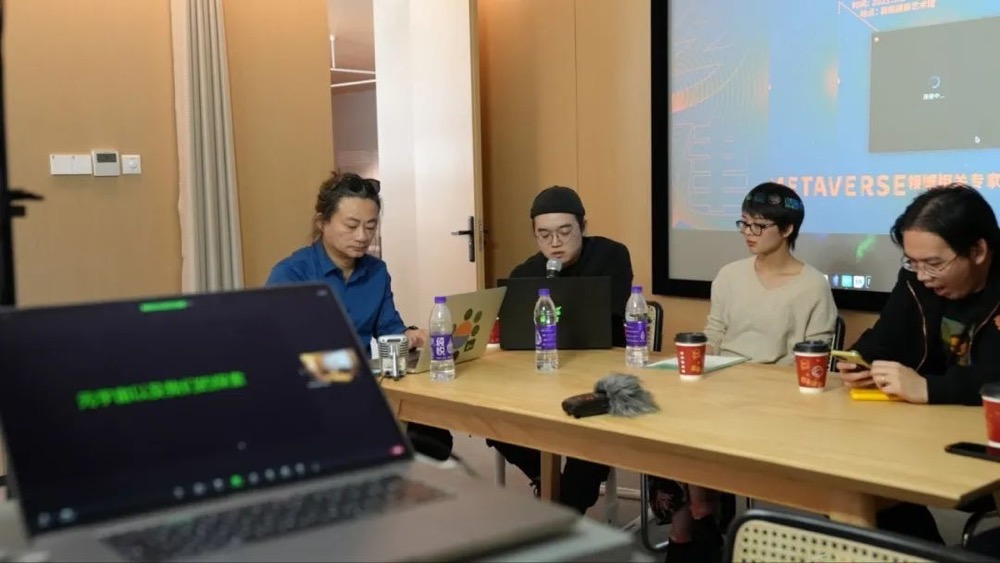

Flynn发言中

---

唐晗：

谢谢黄老师。

CryptoC 目前主要是一个社区，一个立足于 NFT 的，把创作者和藏家，还有和他们的粉丝勾连起来的一个社区。同时，我们也在呼唤自己的线上化营销风潮，这风潮立足于东方创作人和一些新时代的收藏者。

我主要想谈一谈和黄老师所相识的一个经历——主要是因为看到了“乡建中国”这样的一个展览。大概在两周之前，我看到了 Decentraland 上这样的一个展览；这在当时给了我很大的震撼。我本人是从乡村中走出来的一个人，据我观察，当代乡村正在发生很多的事情，比如它正在被城镇化所吞噬、它正在消失......我所生活的村子其实也已经被拆了大约 3/4，现在还剩下一小部分没有被拆，就是拆到我们家门口。

从出生到现在，我体验过一个非常剧烈的变动。在我小的时候，去上学都是走泥土路。我要经过水稻田，田里面会有水蛇，我们看到水蛇还会很怕——小时候看到蚯蚓，以为是水蛇，还会躲到妈妈的背后。等我长到了 10 岁左右的时候，村庄就开始建水泥路，就开始砍树。再后来，村子的人就越来越迁往城市。我从 18 岁离家开始直到去年疫情，其实已经有长达 7 年的时间都没有怎么回到家里——也就在每年过年花个几天的时间回到家里；我其实并没有好好的去体会整个......无论说是家里的变动也好，还是说整个乡村的发展也好，我感觉跟我关系也似乎没有那么大了；因为我也“城镇化”了。

但直到去年新冠肺炎的疫情（因为我是我在湖北，然后当时疫情的原因，在家里面待了很长的一段时间），我才能有大概半年的时间呆在乡村，把我小时候所经历的地方全都走了走，看了看，我也到我所在的大别山区里面看了，一看，当时山区里的情况就让我感受特别深，就变动非常地剧烈。

我本身现在从事的领域是区块链。这其实已经是一个如刚刚 Flynn 所说的，一个“高度虚拟化的”领域了。也就是说，我在短短 20 年间，从乡土逐渐“城市化”和“工业化”，到现在，又经历了“虚拟化”。我其实很少看到有谁会把这样一个变动的过程在虚拟世界中反映出来，直到看到黄老师这样的一场展览，感到非常大的触动；包括跟黄老师聊天时，有一句话我记得很深——“人要往前走，但是得往回看”。

我觉得，在现在的区块链领域，大家更提倡的是一种非常高科技的生活。这种生活有一种对科技的痴迷，或者说崇拜。但其实回过头来看我在疫情期间在那些乡野地方的经历，我感觉，相比较科技，更重要的是人的生命力，或者说乡村的生命力。当我们无视它或让它淡化时，心中其实是会有很多的遗憾的。这是我看今天这样的一个展一个感受。

至于 CryptoC，它成立于去年 10 月。当时，加密艺术和 NFT 还没有火，我们想把国外一些比较好的，和加密艺术相关的论文翻译到国内——因为我本人在北大念书嘛，所以我们就开始从事这样一些事情。去年 12 月份，我们在武汉的方舱医院进行了一场以疫情为主题的加密艺术展览——我将我们的经历，和我们所征集的海内外艺术家们在疫情中生活的经历编织成了一场展览。

今年二三月份，因为 NFT 爆火了，社区扩大得很厉害，我们就开始把国内外一些比较好的 NFT 的项目方和投资人都联系到了一起。现在，我们正在孵化这样一个画廊：这个画廊主要面向传播中华文化的一些创作者。我们想让他们有一个展示作品的，更好的变现渠道和空间。我觉得“乡建”就是一件非常中国化的事。虽然我们现在在 b 站上可以看到很多有中国画元素的创作，但也许像是“乡建”这样的东西，才是深深根植于中国文化经济的。

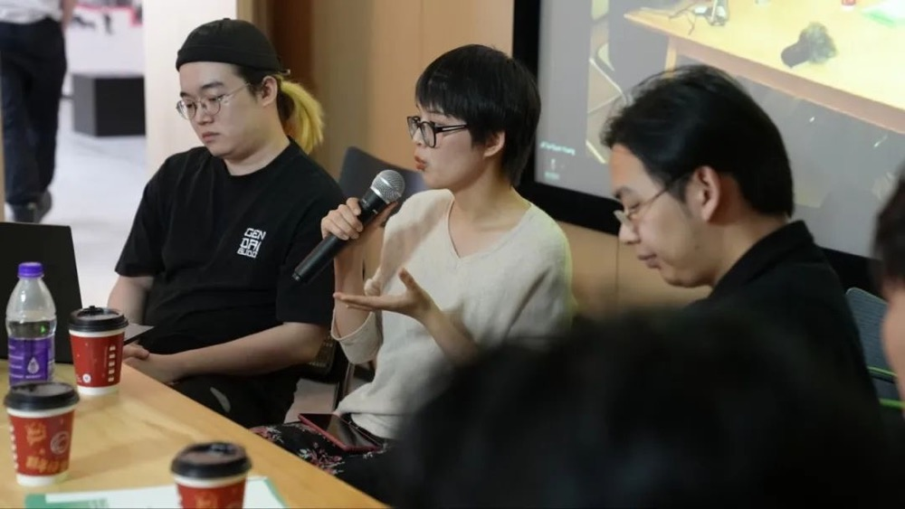

唐晗发言中

---

黄孙权：

谢谢唐晗！接下来这位是我们的老朋友，大家都很熟悉他。他很重要，因为他号称像是 NFT 啊 OpenSea 这种（东西），只是他们 Mask 平台上的一种可能而已，对吧？所以不管是 CryptoC 还是 Metaverse，他把你们在场各位都包括进去了！那么现在我们来看看 Suji，也是一样，先帮我们介绍一下 Mask，然后再谈谈你对这个事情的一些简单看法吧。

---

Suji Yan：

Hello，我应该是很多次来黄老师活动了。先讲一讲我个人和“Mask”正在做什么。我觉得，我们是在旧世界到新世界的过程中——不管是从碳到硅，还是从中心化的互联网到创新的互联网，我们都已经在这个过程中了，它已经来了，或者说“来得不够均匀”。我自己在 17 年之前比较系统性的发现了这其中很多难以描述的问题，到最近，我才能慢慢用语言去把它们总结出来。

我觉得，在这之前，很多人都是在做一些空想实验，有点像罗伯特.欧文（Robert Owen）空想社会主义的这种实验。什么意思？我最常用的例子是 Telegram 跟 Signal 这两个最著名的加密社交聊天软件。它们一个已经把 Token 发了，另一个正要发，但是被美国政府给干掉了。它们的背景是什么？是两个非常著名的创业者在捐钱。Telegram 的 CEO Pavol Durov 曾经是俄版 Facebook 的创始人，后来俄版 FB 被被卖给普金的关联方了，他就拿钱去做了 Telegram。Signal 是美国最大的加密聊天软件之一。Whatsapp 被 FB 收购之后，Whatsapp 的创始人之一 Brian Acton 特别讨厌扎克.伯格（Zuckerberg），就跟他吵架，钱也不要了，就拿了几十亿美元走，又把几十亿美元捐给了 Signal 基金会，让他们去做了一个类似“加密新世界”这样的东西。我在 15 年跟他们几个人聊过，当时，我感觉很难去总结他们的问题。

后来，我慢慢感觉到，如果你从历史的角度上看，他们可能就是罗伯特.欧文，是 New Harmony（新和谐公社）里的那种人。罗伯特.欧文是应该著名的实业家，企业家，资本家。他跑到新大陆去，赚了很多钱，然后在印第安纳州散尽家财买了一大片地（有点像龙城），取名叫做 New Harmony（新和谐）。在里面，他搞了公社币（也就是说，在这个地方，你不能用美元）之类一堆奇奇怪怪的实验。虽然在世时，他一直有钱能支持这整件事；但后来他一死，这一切就结束了，马上就失败了；他死的时候，当地的农民和工人都觉得这人是个圣人，很捧他。因为我在美国上学时是在中部，我们旁边就是印第安纳州。我就和美国人谈，但除了教授之外，很少有人记得罗伯特.欧文是谁，都说：“这是谁？噢......好像有这么一个人。”

我的感觉是，今天，我们迈向虚拟世界的这种努力很像罗伯特.欧文当年所做的事情，不管是加密社交，元宇宙，还是各种不同赛道上的东西；它就是那样的——即便能买一片地，在里面建立新世界，很棒很美好什么的，但只要它不够具有破坏性，就不够具有革命性。这个“破坏”和“革命”一定来自于对旧建制的一种系统性反抗。比如说，我们今天为什么会出现 FB 创始人跑去搞 Telegram 的情况？为什么会有人去搞 Signal？就因为 Facebook 很大，你根本没办法搞他。但你就应该去搞他呀，对不对？你就应该借助新技术和新社会力量——不管是区块链还是什么别的，反正你就是应该去搞他。

我们最早起名叫“Maskbook”，但后来因为除了 Facebook 我们还有好多要搞的，于是 new brand 就升级叫“MaskNetwork”了。

我们认为，密码学武器和这种“新世界”的力量是一种工具，你要把它系统性地给到这些社区里人们的手上。你不能告诉他说“我很有钱！我买了一大片地！大家来玩！”这就像，你去农村，你不能说，“我就把地给全包了！”然后每个人都住很棒的楼，然后你死了一切就没了。一定是说：“我告诉你你为什么会有困难，你为什么会受到压迫，为什么你是一个外卖小哥，你要送很多外卖，然后你要被车撞，你要累死，那是因为这个系统在剥削你。那个系统里面有谁是你的朋友——程序员是你的朋友，因为程序员是工人，他是包工头。可能外卖小哥是农民，但你要跟他当朋友。然后（告诉你）谁是你的敌人——你可能会发现敌人已经快模糊了，敌人变得“异化”了，革命变得异化了。但话说回来，我们系统一定要在互联网里面，你要在它内部去挑动些什么东西，进行一些革新。

我其实特别喜欢这个展，我在 Decentraland 上也会去坐飞机什么的，特别好玩。我觉得虚拟世界可能是一块新大陆，也是一个新的乡村。我们肯定不能说，我们要让一些哲人王把钱放在那块土地上来帮大家；但是，有没有可能让，比如说，小岗村，在未来 10 年有一个“小岗道”，让他们在虚拟世界有一个“小岗 Metaverse”，然后在里面大家能表演才艺，能赚钱，能赛博旅游什么的？然后这里面，人们赚的可能还不是人民币，而是美金。也许我们还能发行小岗村货币，建立小岗村储蓄银行什么的。我觉得这应该会发生。因为我已经看到我们和 200 年前 300 年前那些人相比所取得的进步。我们比 Telegram 和 Single 有进步；比 200 年前的罗伯特.欧文有进步。所以我觉得它会发生。我现在当然主要还是在干自己的业务，只是业余也会经常跟大家去讲这些事情。

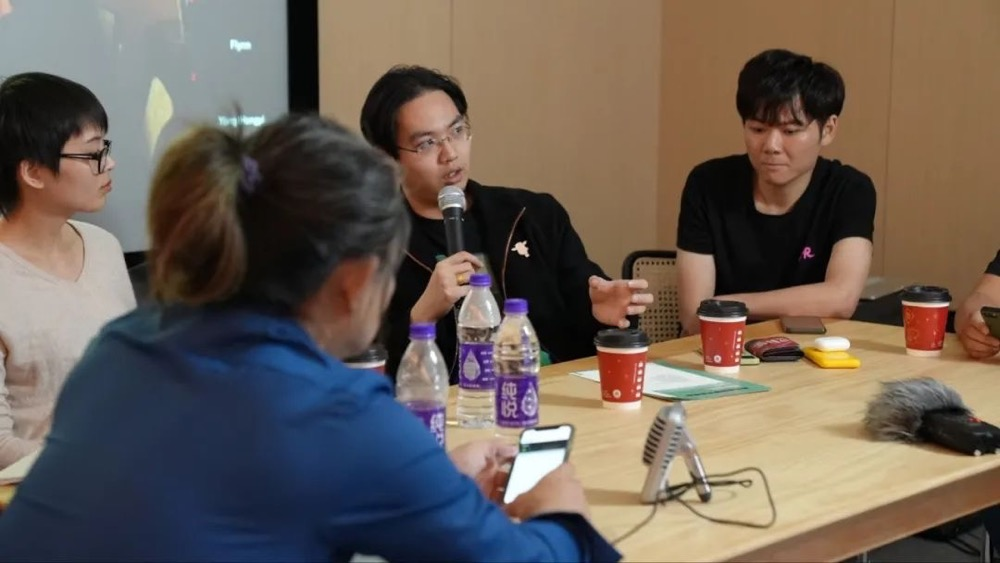

Suji Yan发言中

---

黄孙权：

我只是好奇，所以我要问一下：所以以后 Mask 可以把你们这些东西都收编进去吗？

---

Suji Yan：

我的目标是 5 年以后不要以创始人的身份讲这个事情。

---

黄孙权：

各位要记住 Suji 这句话哦！

我们今天还有另外一个老朋友——蓬岸。蓬岸我们大部分人都已经认识了，但我觉得如果我们要讲历史，特别是电子设备史的话，那一定不可以遗漏他！他实在太重要了！所以昨天我才问他，他刚好在杭州，我就请他过来了。那么请蓬岸也来和我们分享一下。

---

蓬岸：

好的。大家好，我是蓬岸！我主要的项目或者说主要的作品是“网页里的电脑博物馆”。网页里电脑博物馆是一个线上的媒介考古实验室。它利用了当代 web 技术（就是 Webassembly）实现了许多旧式电脑的模拟器。这里面，你可以体验到许多老式的计算机系统和网络系统。

我建这个博物馆其实有一个很重要的想法。我在想，在我所见的简体中文世界里面，人们其实对于信息系统的理解其实是缺失的——特别是在 90 年代，多媒体技术大爆发的时代，电脑、通信网络早期的一些这种技术其实是不被人们所了解的。我觉得这大大限制了我们的想象力。所以，我希望通过某种形式让这些东西能够比较容易被访问，然后拿想象去补全它。

刚才听 Flynn 提到了一点——他不知道怎么去想象没有 html 的互联网；但是，在网页里的电脑博物馆里面，大家可以去体验在没有 ATML，甚至没有 TCPIP 的情况下，我们会有个什么样的计算机网络，它能够给大家一个什么样的数字化生活。我觉得这是现在的互联网公司永远不会跟你讲一个故事。

就它本身来讲，网页里电脑博物馆很多时候是会批判到电脑领域之外的东西的，比如刚刚提到的“线上展览”，“VR 展览”这个事情。我们看到，大多数的 VR 展览的实践其实并不是很当下很现代的。“网页里的电脑博物馆”里面有一个栏目叫“90 年代的 VRML”，我们其实会发现，现在许多人搭建的这种虚拟展馆，其实在 90 年代 VRML 流行的时代就已经被广泛实现过了。

当然 MetaDAO 的作品应该说是我近年来看到的作品中非常精彩一个，因为 MetaUniverse 本身不是一个封闭的空间，它的空间更广阔，许多人会共同建设它。它不是一个完全由策展人独立设计的一个封闭线下白盒子的线上版。这实际上是一个非常大的突破。

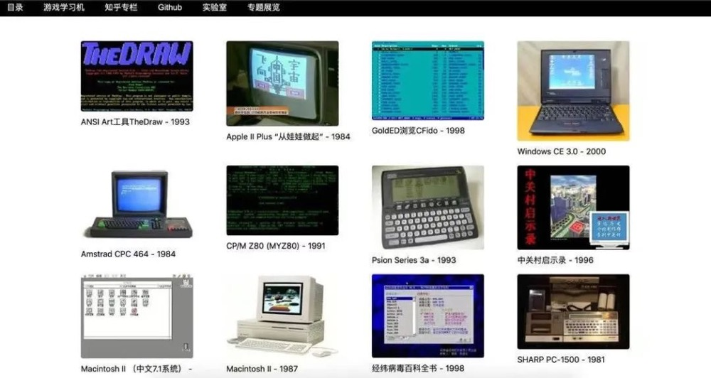

网页里的电脑博物馆主页（图片取自 <a style="font-style: italic" href="https://mp.weixin.qq.com/s?__biz=MzI0MzQzNTczMA==&mid=2247486945&idx=1&sn=b46f86134965afb3858f9a58b557671f&chksm=e96c5c5cde1bd54a7916640b0aecad962461c5b2dbbe8b2a29de877ae034e4f940c8c86bdbc8&scene=21#wechat_redirect">蓬岸第五届网络社会年会演讲</a> ppt）

---

黄孙权：

谢谢蓬岸。各位如果有机会去他的博物馆看看，就会发现内容非常精彩。而且我觉得，像他刚刚讲到的 Gopher 什么的，大概只有我这个年代的人才会知道，你们可能根本都没有听说过。反正那是我在大一大二才会用到的东西。

好，接下来让我们有请 Metaverse，也就是龙城的 Roy。其实我们之前也没有见过面，很高兴他可以来帮我们介绍整个 Metaverse 的计划，以及他对刚才所有内容的一些看法。

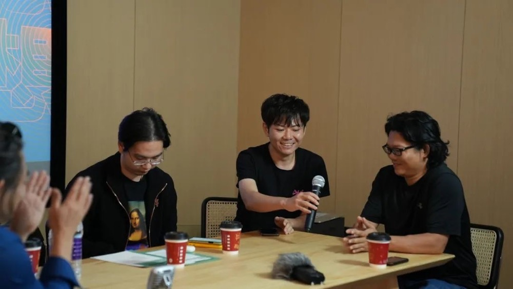

活动现场

---

Roy:

好，谢谢黄老师。关于龙城，其实刚才 Flynn 已经说过它的一些历史了，那么我就说一说我们这个团队背后的一些故事。尤其是我们为什么会参与龙城，后来成为龙城城主，踏入 Metaverse 领域。

这些历史可能是跟我个人的兴趣有一定关系。我在读研的时候就对 Virtual Society 感兴趣，尤其受到当时在中国很火的 Second Life 启发。我研究区块链历史是挺长的，在 2017 年 Decentraland 发布时，我们公司也有投资，因为刚好，它的概念和我之前的兴趣是一致的。当时，我们公司也算得上是投资 Decentraland 的、全球范围内最大的公司之一了。我们在 Decentraland 上也有一些私人公司所有的土地。

接手龙城其实是个很偶然的事件。在 17，18 年整个行业非常低迷的时候，大家都觉得这个项目要凉。那两年，龙城的前任城主看不到未来，觉得整个社区没什么人在讨论这个事情。我一想，这也不妙。因为我们是投资者，也有 Token 在地里面，于是后来，我就接手了这个东西。当然，我接手不仅是出于一种商业考虑，还因为我本身对这件事就有一定的爱好。所以，我们在 18 年成立了 Metaverse，专门去做相关的事情。

我们 2019 年就开始规划龙城背后的世界观了。其实大家从“龙城”的名字就能看出，它是关注中国传统文化的。针对这点，我们做了许多关于中国传统文化当下的状况的调研。为此，我们还专门成立了调研小组。我们研究了山海经，研究了敦煌，研究了古诗，还研究了玄机图......

我其实非常受漫威漫画故事背后世界观的吸引，龙城的规划其实也受到了他们的启发；在此基础上，“传统文化如何走向未来”是龙城所关注的问题。大家都知道，现在的欧美电影往往有很丰富的西方传统文化背景，例如希腊神话、北欧神话。但当我思考东方，尤其是我们中国的时候，我发现我们似乎缺乏这些东西。为什么中国传统文化对现在的小孩子来说似乎没有太大的吸引力呢？带着这样的问题，我们就去研究了中国传统的神话体系，但发现它其实有些“不成体系”，满天神佛，并不像古希腊神话那么成体系。当然了，我不是这方面的专家，我们是很希望能跟一些真正的文化的研究者合作的。

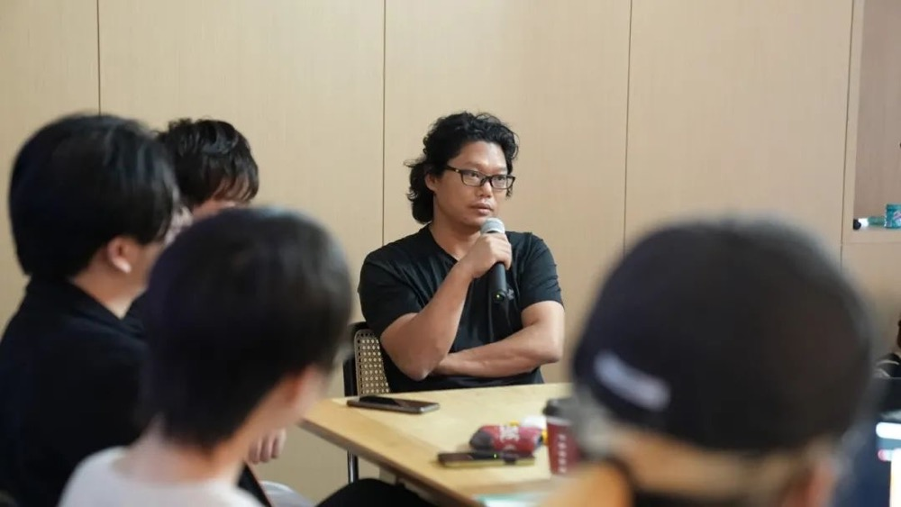

Roy发言中

---

黄孙权：

我刚看平面图，龙城占了 Decentraland 很大的一块地方......十五分之一吗？它是很大的一块地。

今天其实主要是请各位来帮我们出点主意。好不容易把各位骗过来，我在想，我很久没有碰技术了，我技术大概远远跟不上各位，所以我想要请教很多各位技术问题。

假设我们今天就像龙城一样想在虚拟世界投入和保存我们中国文化的一些东西，那么，就学院的角度来说，我们常常遇到一些困难，就是说，我们到农村里头做研究或者帮村民造房子其实都不是太难，甚至于要对国家政策提出一些建议其实也没那么难——只是不知道建议会不会被听见而已。我们的难处在于，除了这种非常具体的为村民解决现实困难的问题，我总是感觉到一些使不上力的地方。

“使不上力”就好像我刚才讲的“三个第一村”一样。我知道它有非常丰富的历史，但当我去到现场，我不管访问多少人，拍多少影片，我透过文字和影片能够说的就只有这么一点点。

可是，比如说你进到十里店，北碚，翟城村，每一个人都可以讲不同的故事，所以我常常幻想......虽然这有点严肃，但我想说，历史上所有的书，所有我们能看到的文本其实都符合福柯所谓的“权力之光照射到的地方才有历史”的表述。权力的光线照不到的地方是不会有历史的，所有的史书之所以能被写就，被看到，都基于权力的允许。很多少数民族其实有许多不为人所见的历史，许多失败的历史也是不会被看到的——我们永远只看到猎人的历史，看不到猎物的历史，对吧？因为猎物都被杀了。但猎物也是历史的一部分。

同样的，我们在做乡村研究的时候常常看到的一种“成功者的故事”，一种权力允许下才会出现的故事；但我一直想说，那些“失败者”的故事和声音怎么才能被呈现呢？

Decentraland 这样的界面似乎可以让我假设：如果把权力的光打散的话，诸众的声音就可能浮现了。也就是说，我们应该把历史本身变成一个 Metaverse 才对。我们可以看到，《雪崩》这本小说一开头所描写的 Metaverse 其实非常次文化，对吧？它还是跟现实有关的，可是，如果我们可以把历史本身当做一个 Metaverse，我们该怎么想象这件事情？

第一个事情是理论的问题，就是如何让各种不同的声音，让那些逝去的石头，那些建筑物（因为建筑消失得非常快，再隔几年我们说农村都不会是几千年来农村的样子了，它们可能全都上了砖混，要么就钢筋水泥的房子，很快的，一些传统建筑木结构全部都毁了）都出现在这里。而且我们乡建中国实践者大会的嘉宾也提到，帮村民们盖一个非常具有地方材料的房子也许反而会让他们觉得很土，他们想要的是钢筋水泥的房子。

所以我在想，就各位的经验来说，我们怎么在 Metaverse 这样的领域里，让诸众的声音和诸众历史复现？我们会遭到什么样的技术的，或者政治和经济条件上的困难？我想开放地让大家来讨论一下这件事情，谁要先开始说说？

---

Suji Yan：

我想讲一个跟我们有点关系的故事。

有一个公司在跟我们合作，它叫 Valuable。它有个平台叫 Cent。他们把推特的推文变成了一个 NFT 的买卖。他们在做的事情可能在很多人看来很蠢，但直到几个礼拜之前，推特的 CEO 把自己的第一条推文挂在平台上卖，他的第一条推文“Just setting up my first twttr”在当时被拍到 290 万美元，于是他就接下这个 challenge，要把推文卖掉。

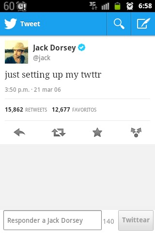

Jack Dorsey被拍出290万美元的推文（图片来自网络）

什么叫把推文卖掉？其实你也没有一个物权的，没有一个物在那边。这个推文可能是一个脱离了推特公司的服务器所创造的一个数码物。推特的 CEO 把这东西卖掉，卖了之后把钱捐给了非洲的一个 NGO。很好玩，我不知道为什么有人买，买的人肯定也是为了炒作，据平台其实也不知道是谁在买。

我们后来就总结说：如果你从地里挖出一个汉谟拉比法典，它值多少钱？汉谟拉比法典是人类第一步成文的法典，它的考古价值是很大的；推特 CEO 的第一条推文可能就像汉谟拉比法典一样——毕竟这可是人类历史上第前几条推文，对吧？推特是多么重要的一个数字空间，这可是有美国大统领被封掉的地方。推特创世人发送第一条推文是一个历史性的时刻，它才卖 300 万美元，是不是便宜？

但如果推特是一个村子或大城市的话，很多用户可能也并不重视这第一条推文。你可能会觉得说，这东西不重要，我需要的可能是更多别的东西。比如，要是今天你去小岗村或是哪个村子里和村民说：“你们这里是中国改革的活历史！”，那对方可能就会回答你：“I don't care！我要住进上海，我要搬进东方明珠！我不 care，我这个房子赶紧给我拆了。我要拆迁！我要拿钱！”一样的，现在假设你有一个推特账号，有人说你的推文值 10 万美元，他可能就会赶紧把推文卖给你，拿 10 万美元去买吃的买喝的。也就是说，人们怎样才能意识到这东西的价值呢？比如，有没有可能让人们把它当做一个把个人生产变现，解放工具来看，而不是一种让人生产得更惨的工具？

现在的情况是，可能村民本身不愿意种地，或者他种地其实也是迫于生计——他并不是在一个解放的过程中。比如，我们把手机给农村的小孩子的时候，他第一个下载的是快手，第二个可能是抖音，他们没有把手机，把这些 app 当做解放工具去使用，反而是这些东西使他们成为了中国农村的样本之一。然后但这些样本本身就具有极大的价值。快手难道没有价值吗？它的商业价值跟非商业价值都非常大，但快手没有把这些价值给到这些使用它的人。

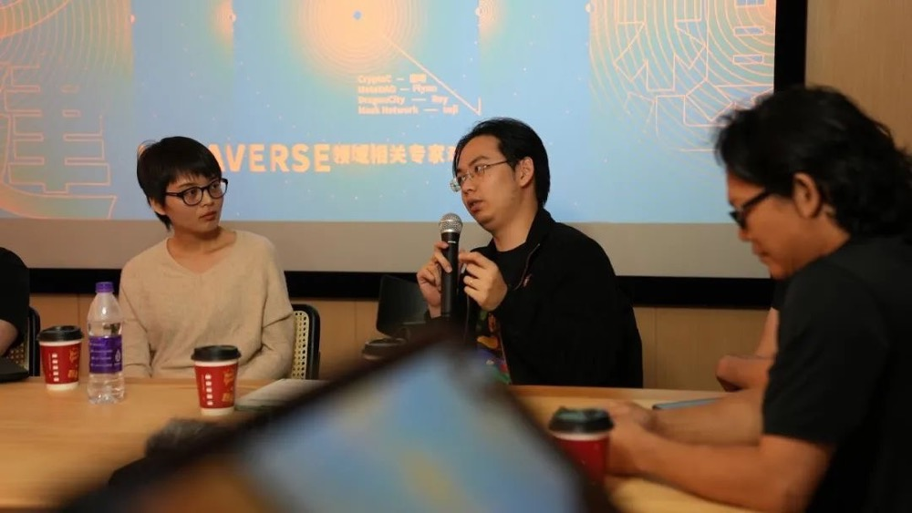

Suji Yan发言中

---

黄孙权：

我觉得你的想法很实际，就是说，你真的要让农民可以感受到有人重视他们的东西，否则他可能就会想要搬走，要拆迁，觉得拿到现金比较重要。

我们第一条快手的视频也可以做 NFT 卖出去吗？

---

Suji Yan：

理论上是可以的。

---

唐晗：

国内有人开始想去拍卖微博了，已经有公司准备要做这样的事情了。

我想说，我们所做的事情应该最终还是要落实到“如何去服务农村里面的人？”这一点上。当前农村除了在基础设施上走向城镇化之外，其实还在另外一方面走向城镇化，那就是科技。科技究竟给农村带来了什么？它带来的是更多的一个获得感，还是一个剥削感？或者说，农村的这些人以后在我们的生产体系上是处于一个更高的位置还是一个更低的位置？

从软性层面上来看，（农村人）应该是处于一个比较可怕的，更低的位置。我虽然作为一个进入了社员体系中的现代化的人，但我也可能并不知道该怎么样去使用这些现代化的工具。虽然，就像 Suji 说的，我们要为一些人争取他们的的自由，为了争取权力去提供一些网络工具；可是，大家可能既不知道这些网络工具在哪，也不知道该如何去使用它，甚至还会错误地进行使用。

比如说，当快手和抖音进入农村的时候，是有很多人利用它去成为网红或者去带货，但是更多的是什么情况？更多的是农村这些两三岁的小孩子，他可能说话都是从抖音或者快手里学的。他的家庭教育，就是原来农村中那种“代代相传，诗书耕读，父母对孩子有非常重要的言传身教影响”的这样一个教育体系被完全打破甚至瓦解了。孩子们从一些碎片化的，非常夸张的短视频中学习，形成自己的价值观念。可以说，这基本上是击垮了我们之前乡村的教育体系，形成了一些非常恶劣的影响。在城市的孩子开始去补习功课上各种辅导班的时候，农村的孩子正在这些平台上面学习着一些奇怪的东西。他们其实已经脱离了父母的掌控，很难再被扭转过来。

我想说，当科学技术进入到农村时，它所带来的不一定说一个好的改变，也很可能是对他们生存的环境，或者是他们的所处的一个体系的破坏。也许，孩子们其实需要人教育他们怎样使用......包括农村的父母可能也很困惑——我应该怎么样让我的孩子从一个科技体系中脱离出来？他们其实希望孩子们能从这些科技产品中脱离出来，能够听我的话，或者说能够接受更好的教育。这个工作肯定需要有人去做，否则以后我们会看到一个可怕的，认知上的差距。为了应对这点，我们的做法可能要先从普通的互联网产品开始，慢慢地，通过我们目前所能提供的一些科技工具来完成。

除此之外，我想说，就算我们现在想在 Metaverse 上为乡村去做一些事情，更好的办法可能也还是进入 Metaverse，重塑乡村的生产关系和交换的关系。Metaverse 尤其令人感兴趣的一点是它让虚拟世界和现实世界发生了一种深刻的“互动”。我们之前的交易基本上是在线下世界产生的，现在可能是在淘宝中产生。那么，未来我们能不能把乡村的一些交易和交换搬到 Metaverse 的空间？

如果要搬的话，它一定是一个大体量的过程。而就 Metaverse 现有的基础设施来看，它的土地地块有限，地皮也很贵，就算要搬，也基本上是以一种艺术品的形式来搬，不足以承载上述理想；那么，未来我们是不是要在 Metaverse 领域去启动一些基础设施的建设，去降低地皮的价格，去给所谓的现世界的平民一个能在 Metaverse 世界中容身的地方？我觉得这是比较重要的问题。毕竟，还有很多的朋友可能也想进入到 Metaverse 这样的世界里面，但基本上都是被地皮的价格堵在外面——比如我知道有人想在 Decentraland 或者是 CryptoVoxels 上去复现一个虚拟的上海。他们当然也很有钱了，但是一看到这样的价格就被吓住了，说，我实在是掏不出这么大一笔钱去买这么大一块土地。这可能是现在的一个比较迫切的问题。

---

黄孙权：

很多学术研究已经指出，我们下一代的孩子其实是网络养大的，他们再也不是父母（更别说老师了）养大的了。这就是新一代教育所面临的网络资讯带来的影响。

农村教育当然是一件很重要的事情。比如，我听说 Roy 他们把台北故宫的很多东西都搬到龙城上去了。那么，假设我有机会让农村的小朋友看到 Metaverse 上的故宫藏品，我们应该怎么去展示它们？这是一件起码能教室里实施的事情。待会可以请 Roy 来帮我们想想看，这个事情怎么做。

刚刚唐晗还让我想到另外一个问题，就是在中国，我们有没有可能建一个像 Metaverse 这样的地方？有没有可能有一个 Metaverse 版本的斗地主游戏？我们刚看到中国土改第一村，那么，Metaverse 会不会有类似土改第一村的东西出现？

---

Roy：

从何说起呢？

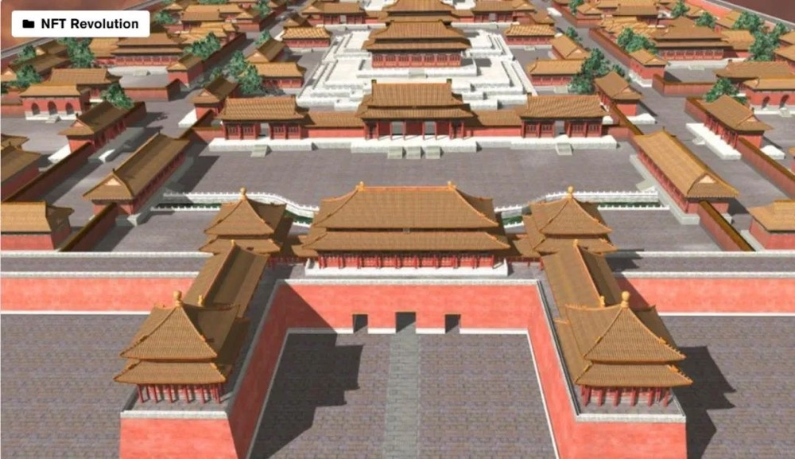

龙城里的故宫（图片来自网络）

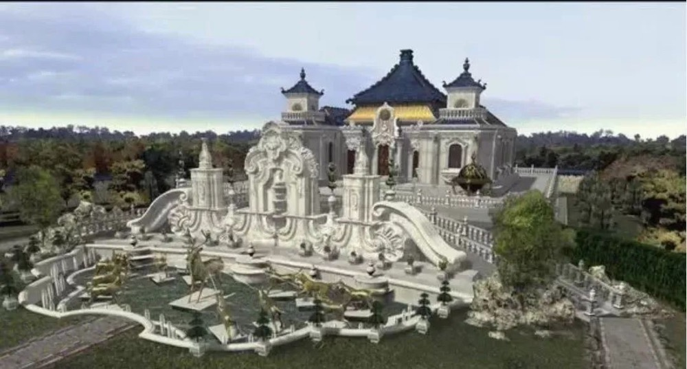

龙城里的圆明园（图片来自网络）

在 17 年 18 年我们还在讨论龙城有什么用的时候，社区经理去收集了的一些 idea 回来，这些 idea 从虚拟坟墓到斗地主，打麻将，什么样的都有。现在往回看，这些点子也挺有趣的，我们现在的很多实践也在去参考大家之前的一些想法。但是，为什么大家会产生这些 idea？其实就是因为现实的原因。比如据我所知，现在的一些穷人在亲人去世以后是没有办法把亲人的骨灰妥善保存的，因为那也要付钱。我想，虚拟世界之所以在早期会吸引人们的注意力，是因为大家希望那些在现实中遇到的问题能够在“另外一个地方”得到解决。

我觉得这次展览的主题“乡建”其实是对“空间”的思考。人类对空间的思考其实从来没有停止过。从远古时代我们住在洞里，到后来未来向外太空的迁居其实都在探索空间。而我觉得，当下的我们正处在一个非常关键的时刻，我们不仅要思考我们到哪里去，也要思考我们从哪里来。大多数人在迁往城市或追求高科技时，很少人去回看我们的历史。这既是我今天来到现场所主要考虑的事，也是我们去做农村相关的调研和研究 Metaverse 的原因。

Metaverse 的 slogan 是“be a second home”，我们希望给每个人建第二个家。3 年前，我想，乔布斯无疑是当时当代最伟大的企业家之一，但是在他之后会有谁呢？当时我觉得，企业家必须去思考人类的未来。去解决人类可持续发展的问题，然后很自然的就有一个人浮现在我的眼前，那就是伊隆.马斯克。马斯克要做的事情其实就是想象有一天地球不再适合人类居住时，人类怎么避免愚蠢无知所导致的灭亡？在做 Metaverse 的时候，我心里其实也在思考类似的问题——如果我们要迁去一个更加可持续的地方，那应该是哪儿？也许 Metaverse 就是这样的地方。

至于黄老师刚刚所说的“如何帮助农村”的问题，我认为，我们当然可以去怪这些 IT 公司，可以把伤害归咎于各种各样的事情，但我心底觉得，其实每个人有每个人自己的责任。为什么会有问题出现？是因为缺失了什么东西吗？是因为我们某一部分没有做好吗？我们现在责怪抖音不该出现也许是无济于事的。作为“关心农村的人”，我们应该让自己的行动为农村带来一些正面的影响。比如，对我来说，龙城敦煌项目的动机是因为我 07 年的敦煌之行。大家都知道，去一趟敦煌是非常辛苦的过程。我就想，我们能不能做些什么，让大家以后即便不亲临现场也可以看见敦煌的古迹呢？我想做的事是适用于中外敦煌爱好者的，当然同样适用于城市和农村。

说到这里，我觉得，或许为农村朋友提供更好的学习设备是行之有效的帮助农村的方法。据我所知，印度就有一些与之类似的计划，他们试图开发轻巧便宜的电脑供贫困地区和农村地区的用户使用。我觉得，这也是我们应该思考的——我们应该为农村接触更好，更优秀的东西提供便利，而不是说，让农村成为一个“没有围栏的地方”。或许，好的技术可以给农村建设“围栏”，这个“围栏”同样是为发展和学习提供便利的工具。

---

黄孙权：

我觉得 Roy 所说的内容非常关键。我们老是怪别人创造一些不良内容，可是内容是大家都能创造的。要说是淘宝和抖音“带坏了孩子”，不如说是“城市的恶习”带坏了他们。不过，我觉得有两点非常有趣，值得和各位讨论：

第一点是，我们有一年的网络社会年会邀请了阿里巴巴的 CTO 王坚来演讲。他说，你们现在所有人都苦思冥想着如何跑去别的星球，跑去火星（或许他指的是马斯克），但真正的难题其实是“如何留在地球”。确实，科技的发展可能使得我们跑去火星变得越来越容易，留在地球却越来越难。这句话作为他演讲的开场，把大家都逗笑了，但某种程度上来说，如何留在地球其实是一个挺严肃的问题，就好像我们如何“保留”农村一样。

第二点我觉得是：确实，给农村孩子一个好的技术工具（像是电脑或手机）都很重要，但其实他们的手机现在都非常好了，起码基本上上网拍东西没什么问题——虽说，当然，像 Metaverse 这样的东西可能不能靠手机来跑，他们还是会需要一台更好的个人电脑；但，如果这些东西......就是说，我们每个人当然都应该在“自己能力范围”内多做一点事情。但对我来说，重点还是除了“自己做”以外，还要大家手拉手“一起做”。

比如，说到敦煌，因为美院和敦煌有比较好的关系的缘故，我们的同学在现场可以看到非常多一般不对外开放的特窟。我们也许能看到师傅带头，日以继夜地在修复，过程非常精彩，它本身就是一个非常好的教程；但问题是，怎么让更多人也看到这样精彩的教程？如果这些珍贵的内容一直被锁在某个学院的里头，是非常可惜的。

---

Flynn：

刚刚讲到关于农村的问题，其实我觉得，现阶段，Metaverse 世界本身也存在着很多有待解决的问题。比如很多城市人进入当前的 Metaverse 后，可能在其中会面临新一轮的阶层划分。甚至于，进入到 Metaverse 之后，有些人的阶层较之于他在现实世界的阶层会有所下降，这可能是一个问题。虽然 Metaverse 世界本身有很多需要解决的问题，但或许，我们对 Metaverse 问题的解决会为我们解决现实世界的问题提供思路，所以我觉得在虚拟空间中进行一些探索，可能是有利于现实世界的。

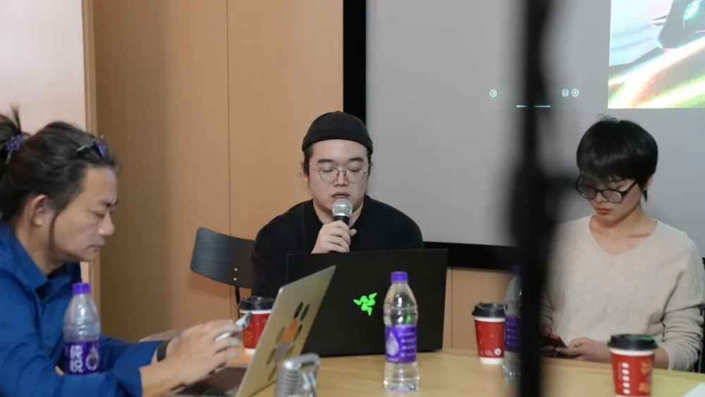

Flynn发言中

---

黄孙权：

我也觉得。

因为我们真的跑过非常多的农村，各种农村状况都很不一样。我常觉得，有些在实体空间会被限制和制约以至于不一定可以达成的东西搞不好可以在虚拟空间做到。所以我觉得我们让它变成行动的对谈，最好的方法就是......比如说，我真的下次去找个农村，我们带一个稍微好一点的电脑，然后我们就进到龙城，让他们看看敦煌或故宫之类的，就很实际嘛。

然后你们要找一个导览员来。我们也不用讲一些有没有的事，就说：“我们来上网玩耍！”我们需要更多人在创意的层面上想象这种操作的可能，这样，很多事情或许就会变得不太一样。最起码在现有“地主”（Decentraland）被打败之前，我们只能尽可能利用手头的资源行动。但我还是希望以后可以有一种开放的，限制不要那么大的，起始点不要那么高，价格也不那么昂贵的平台可以让我们开始实验，你可以让土地 70 年免租期，但是先给我们一个实验村，给我们一个新村，就当实验基地。

---

Flynn:

其实我们内部现在有在构思一个新的虚拟空间，这些虚拟空间可能会尝试解决虚拟空间现阶段所遇到的问题，包括现在虚拟空间土地价格过高的问题。我们希望通过技术方案让空间本身不再稀缺，一种思路就是让内容成为价值本身。换句话说，你不需要再去考虑你空间的问题。现在虚拟世界里的公共空间也在模仿现实中的空间。在土地拍卖的过程中，你可能并不认识你周围邻居；但是我觉得，虚拟空间中可以有其他的空间组织形式，比如你不一定需要去挨着一个你不认识的人或者你不喜欢的人之类的。我们可以完全可以利用技术重新去组织，让空间变得更加灵活。

---

黄孙权：

我一定会 follow up 你们的消息，看看未来有没有合作实验的机会。

我现在还想请教各位......展览开幕那天，我们在楼上烤肉时谈过类似的话题，就是说，我去了很多村子，有些村子其实不见得有那么多那么好的资源，但有些村子的资源确实非常好。这资源不一定是风景，也可能是与非遗相关的人才、非遗的技法——从藤编，到食物，到侗族大歌之类的。

我想，我们有没有可能在在 Metaverse 里重现某种非遗的一个技术的同时把它们 NFT 化呢？我们或许可以把 NFT 当作一种众筹，把非遗文化做成数字资产。我只是乱想，如果是这样的话，这个非遗的数字资产可不可以属于这个农村集体所有？那么当 NFT 拍卖的时候，就有更多的资金可以实际进到农村里头，他们就可以继续发展他们的手艺。第一个是这种整体架构的问题，我也不知道我这样想是不是过于天花乱坠？这有实操的可能吗？

除此之外，有很多技术实践的方面会需要各位的帮忙。比如说，对于多声部合唱且男女声部分开的侗族大歌来说，录制时，我们会遇见空间的声音、主旋律的带唱、还会遇见是否需要把每个声部分开录制的问题。整个侗族大歌是一层的资产，每一个歌者又是一层的资产。所有这些在传统的数字保存里是很难区分开的，但透过 NFT 却可能实现，我认为目前出现的许多 CryptoArt 其实都在玩这类似的游戏。

据我观察，像侗族大歌这样的非遗中有很多这样“多层”的例子。四川的木结构民居也是类似的——整个结构当然是一层，但木结构建筑其实是很复杂的，它有框架，建筑时需要雕刻的师傅，上梁的师傅......每位师傅都像是一个 craft，这些 craft 都有可能变成 NFT 的一种。

我其实不是从商业的角度想，而是从可以回到村民身上的“保存”的角度想。我有某样手艺，你短期内显然也学不了，但你可以资助我，搞不好还能吸引年轻的孩子来学习这门手艺。这是我最近非常想做的事情，不知道是否可以实施，但我觉得如果能实现一定很棒，因为这样一来，我们就可以让 NFT 不仅是币圈炒作的游戏而已，而是变成另外一个层面的技术。

---

唐晗：

我要说的并不是非遗，但是是一件可被实践的事，一种组织生产的方式。

据我了解，有一个养了大概一万头牛的澳洲牧场试图把牛铸成 NFT。他们是怎么想到这样的事情的呢？大家知道，之前有一种模式叫“云养牛”。我自己是一个牧场，我有一万头牛，牛对我来说是非常重的资产。一般来说，要开这样的牧场，我需要向银行借一笔钱。假设我经营不善，无法维持内部运转，那我很可能就资不抵债，面临清算了。这时，他们想到了另一种方式，就是先让大家像认领宠物一样先把单个牛领养走，那么这只牛今后的经济收益就都归你，若你将牛转卖，产生的经济价值也都归你。之前，要这样操作可能不是很方便，但现在，他想把每只牛铸成 NFT，这样便于流转，也增加了整个游戏的可玩性。

这个例子比较有意思的一点是，牧场的行为实现了一种联动。我觉得，当我们说到非遗，我们不能仅仅站在保存的角度，去把内容“固定”；我们应该想，如何能让内容和我们的生活产生更深的联动，保持非遗的活力。这是我一点比较粗浅的想法。

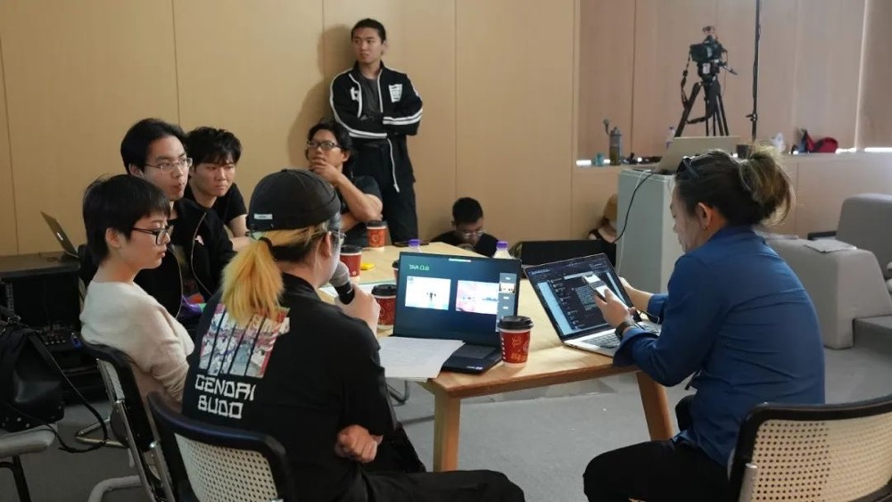

活动现场

---

黄孙权：

这点也是很关键的。我们知道台湾其实也做了很多数位保存或者说“数位资产化”，大多数东西都是 file，是 archive，它们是死的，没办法回到正在发生的变动里头，这就有点可惜。

真的？已经有人在做非遗的 NFT 了？

---

Roy：

是的，其实这是我们另外一个团队正在尝试的事情，这个网站叫做 ETH.gift，大家可以上去看看。这个项目还是源于龙城当时的定位——希望去呈现中国最宝贵的文化。

去年过年 Flynn 在策划龙城的新年活动的时候，我们想，能不能在活动期间赠送一些 NFT 给大家？当时，我们正在合作的加密艺术家正在大理学扎染，扎染本身就是一种非遗的技术，我们于是一拍即合，当下就完成了这件事情，反响也挺不错的。因为可能每一次的扎染都会带来不同的结果，于是我们就用区块链把它记录下来。

至于黄老师刚刚提出的几个假想，我觉得都是有可能实现的。NFT 其实并不是什么特别神秘的技术，它的可能性还是源于区块链本身。当思考 NFT 能做什么时，我们其实应该回到区块链本身，去想想它能做什么。在黄老师刚刚提出的几个假想中，最难的部分可能是“储存”，过去，就算我们把东西电子化，内容还是储存在服务器上。你当然可以像谷歌那样在各地设立各种各样的服务器，而且他们作为耗电巨兽，数据库常常会建在水坝边上，还要预防极端天气之类的——这样储存的成本是很高的，谷歌他们也正在苦思冥想如何降低成本。但区块链出现之后，其实某种程度上解决了这个问题。

区块链的一大特点就是去中心化，也就是说，它解决了系统容易崩溃的问题。虽然，如果要把问题进行深入探讨，讨论是否能把数据存到人类灭亡（这就不一定了），就会有点超纲，但正在进行分布式储存的 NFT 其实可做的事情非常多，它不仅有不可变更性，还有时间戳所支持的“唯一性”。我觉得就技术上来说，要实现非遗的保存是没有问题的。

---

黄孙权：

蓬岸要不要说说？技术问题就交给你。

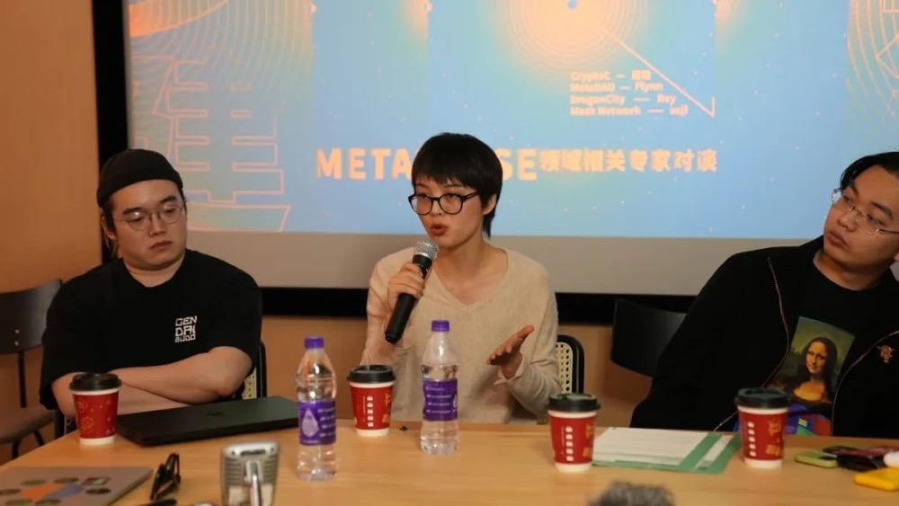

唐晗发言中

---

蓬岸：

好的。黄老师刚才提到一点——历史都是权力的映射，许多在权力系统之外的，或者权力之下失败者的声音会被遗忘掉。但我觉得，“网页里的电脑博物馆”就是保存权力之下失败者声音的一个 case。举个例子，我们保存了 TomPDA 论坛的交易记录。

TomPDA 是中国早期电商实践的一个平台，许多数码爱好者借助这个论坛进行交易。这个论坛大约在 2018 年左右就结束运营了，我在它结束运营之前把论坛信用记录里的数据给扒了下来，放到了“网页里的电脑博物馆”里。然后我发现，早在 2004 年就有农产品在平台上进行交易了。在 2004 年 3 月 4 日早上 10 点 03 分，有一笔记录在上面被记了一个信用分，它叫做“山间美味超级保健香薷，质量超好，有详细图片，请大家来看”，这应该是在销售一种菌菇类的产品。也就是说，我们的农民或农产品经营者在面对数字技术时似乎比我们想象的要强壮，有韧性得多。所以我认为我们大可不必对“农村小朋友看抖音”这件事情过分担心。

可能我们会发现，今日农民们所表现出的数字素养并不高，但我们不能不考虑一点，那就是，农村中数字素养最高的那批人离开农村了。与其将农民数字素养不高归咎于企业压榨农民，不如说这是“农村空心化”的作用。比如，当一个农村人有了更高的数字素养，他们很可能会跳到一个收入更高的行业中去，比如去城里做码农。我认为，“农村小朋友看抖音”是一件多元的事。

除此之外，我还想说，很多时候，我们在研究农村地景时，可能陷入了一种“城里人的乡愁”，农村当地的居民未必就喜欢留在传统的生活方式中。因为，全世界人民对美好生活的向往大概都是一样的。尼克松和赫鲁晓夫之间的厨房辩论以赫鲁晓夫的孙女移民美国作为结尾——人们不仅想要土豆牛肉，想要吃饱饭，也想要尼克松厨房，有洗碗机，电冰箱，要有高质量的生活。我们可能觉得村民们有非遗，有木结构的建筑，天天生活在文物里，非常令人向往；但也许村民们向往的是尼克松厨房。

那么，当我们在想着要把他们的东西保存也好，通证化也好，上链也好，我们都需要考虑到乡村居民他们到底想要什么。可能确实是我们把他们的东西保存了，给证券化了，变成一种融资渠道了，但我认为这件事情还是得落实到“提升农民的生活质量”上去。

我在加拿大生活了蛮长时间，我也在 Airbnb 上住过加拿大农民的小屋。他们的小屋未必新，未必奢华，但有一点让我充满感触，就是他们的小屋真的是有尼克松厨房。即使是农村的小屋，他们也会有 24 小时的冷热水供应；因为加拿大比较冷，他们未必有空调，但是都一定有暖气。

但是想想我们，2019 年北京周边在暖气改造时，很多农民因为用了不合适的炉子或燃料而煤气中毒送医，甚至丧命，而且这样的事情还在继续发生着。我觉得这会让我非常挣扎和撕裂。一方面，我们在想如何保存非遗，将它们通证化，让非遗变现，构建美丽新乡村等等；另一方面，农民的生活质量在很多时候并没有得到切实的提高。

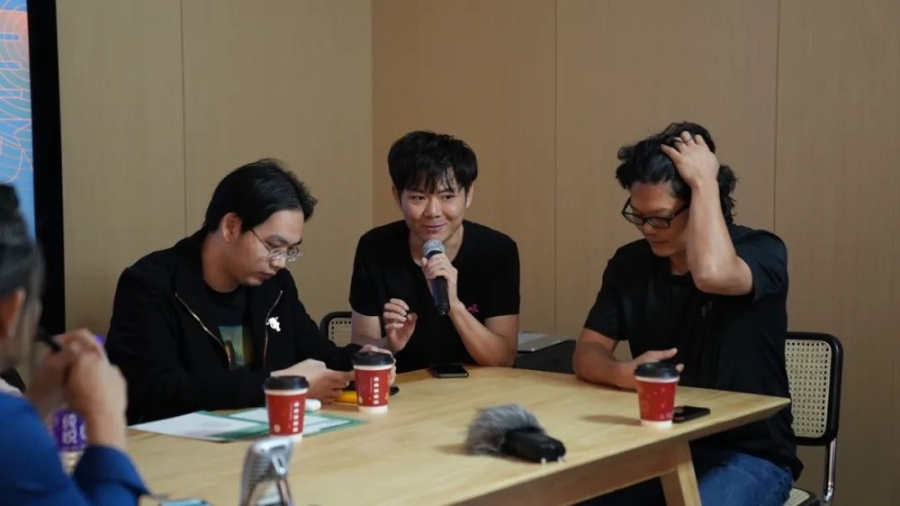

蓬岸发言中

---

黄孙权：

这真的非常关键。就我这几年田野的经验来看，许多农村都是“空屋化”的——村里的房子都很新，但房子里头什么都没有。房子可能是被留给老房主不知道还会不会回来的孩子住的，可能是留给孩子结婚用的。很多农民穷其一生盖了一幢豪华的房子，但里头除了一张床什么也没有。也就是说，在这个“现代化”的过程当中，许多农民非常辛苦。农村的“空心化”还伴随着“空屋化”，就更别提蓬岸刚刚提到的那些现代化设备了。

雅安地震之后，我带着一群学生去当地帮农民盖房子。谢英俊改好了房子的结构，我们就去帮他们上螺丝什么的。当时，距离地震过去都已经五年了，可当地还是有许多人没有改好自己的房子。他们可能是有钱买块砖，有钱买块泥，有钱再买个窗......为了要看电视，七十多岁的老先生还要爬上屋顶去架那个他永远也控制不了的天线之类的......后来，这位老先生为了感谢我们帮忙盖房子，就下山去市场里头买了只鸡上来。他下山花了一小时，上山花了一个半小时，总共耗时两个半小时，买了只鸡回来。有时，你确实可以感觉到我们生活在一个奇怪交织的世界里头——有些东西非常新，有些东西又非常旧。总之，很多奇怪的事情都会在农村里发生。

我觉得蓬岸的提醒非常好。我当然不是要很快把农村的东西 NFT 化或通证化，我知道现实的难处，但我现在有的是一种比较强烈的文化的危机感。就像我之前说的，如果我现在正在目睹一场传统农村文化的葬礼，那么我要做些什么？你再不保存农村的这些生活型态，这些形式，这些技艺，还有村里人和人的关系的话，他们很快就会全都不见了。所谓的“不见”不见得就是不好的意思，毕竟我们所习惯了的东西大多是会重新来一遍，就像 Roy 说的，我们正处在一个“新旧交织的十字路口”，旧东西的“逝去”是自然而然的。

我也不是抱着乡愁说，这些东西有多么了不起，或多重要；但我总觉得，你回过头看时，如果后头如果是空的，感觉会有点怪吧？是这样的紧迫感一直逼着我一直往前走。说到“保存”，我想到的是这样的事情。

但“保存”涉及许多技术的问题，尤其是网络技术这部分我本身并不太会，所以我想说，我应该叫各位来，想象一下，我这边有个不太好的比喻，就是，假如现在有一场非常豪华的葬礼在你面前发生，你要用什么样的眼睛去看见它？那这双眼睛可能就是历史的眼睛，或者是给未来人看的历史。这其实不是帮农村，而是帮我们自己解决自己的困惑。大概是这样的意思。

我们好像有些超时了。要不最后请各位再来做个结语吧，让我们看看未来还有没有其他我们可以一起努力做的事情。

---

Flynn：

我们 MetaDAO 或者 Metaverse Lab 其实可以一直往这个方向去和大家一起努力。这是我们所感兴趣的事情，也符合我们给龙城设立的最初定位。或许，我们可以做不仅是一个“未来的赛博空间”，还可以记录“过去”的事情，让龙城的时间线不完全是一条直线，而是有交错的可能。

---

唐晗：

这样一场中国农村的葬礼让我想到了《三体》里的一个情节。当太空舰队进入宇宙，他们消灭了自己的同类。他们从地球人变成了太空人——他们经历了这样一段身份的重建。他们把可以搁置他们的残骸称作“太空墓碑”，去纪念他们。在一场身份重构之后，他们依然有一个地方用作纪念之前的那群人。我们也一样，中国几千年来都是一个农村的文化，我们是不是也应该为这样快速消逝的东西留下一个类似“墓碑”的东西？我小时候学习唐诗宋词感到非常容易，因为我学到的就是我双眼看到的景象，但现在的人可能就需要依靠想象来学习。某种程度上来说，这就是一种“逝去了就再也回不来”的东西。那么，我们能为它做什么呢？

我之前一直是媒体人，那么从我的角度来看，重要的是让大家看到和接触到信息，去提醒大家。仅仅在 Metaverse 上建构这样的东西是不够的，你还得不断宣传整件事的意义，让大家意识到这件事的紧迫性和重要性。我们非常乐意在虚拟空间讲述一种和人文和未来相关的，与“向后看”所契合的事情。技术的进步是不足以印证时代的进步的，时代的进步应该落到对个人的关怀上。仅仅追求科技的发达甚至从某种程度上来说，是一种“落后”的表现。因为它遗忘了人之所以为人的根本，这样的事总是会让人很迷惘，所以我们得从文化上不断揭示它。

---

Suji Yan：

搞不好以后真正的农村会被搬到赛博空间，现实空间里的那个农村会变成一个躯壳。

---

蓬岸：

我的想法是，大家在文化上确实会感到一种紧迫感或者说危机感，但我觉得，大家还是要保持一种相对乐观的态度。因为许多的“保存”并不是没有人去做，而是还没有被我们发现。我再举个例子。你们有人听过康定情歌的芯片音乐版本吗？其实早在 1990 年代，中国电子游戏机的开发者们就已经利用芯片音乐复原了好多首中国的民歌了。其实，中国人的数字文化一定是中国人的文化，数字文化不可能脱离创作者的文化背景存在。只要越来越多中国人投身于数字空间的创作，数字文化产物就会越来越多得带着中国文化的气息。

所以，在我看来，一个最有效的，保护我们文化传统的方式，可能把更多带着中国传统文化符号的中国人，比如非遗的传承者们，带领到数字文化的创建中。可能这样一来，在我们所能看到的数字文化场景中，会有越来越多中国文化的符号出现。总而言之，我对整件事情保持一个相对乐观的态度。

---

Roy：

我挺认同蓬岸的观点的。其实龙城要做的就是把中国文化精髓的部分融入人类文明的框架中去。我也挺能理解黄老师之前提到的焦虑的，但我还是觉得，有很多事我们并不能阻止它们发生，因为这也不是我们在做各位个体所有能力改变的事情。当然，这件事情的发生可能是人为使然，这也就意味着我们可能也可以做出我们力所能及的努力，试试看，让未来的人在往回看时知道他们也是历史的一部分——我们先不要去评判这件事的对错好坏。刚刚蓬岸说的“保存并非没人在做，只是没被发现”让我很有同感，我觉得，龙城能做的事情或许就是做“能被发现”的保存。

当初我们内部聊到北碚计划时，一直觉得是一件很有意义的事，它和我们对龙城本身的定位是一致的。我们也非常愿意继续为这样有意义的事情贡献土地，但我们所需要的是和更多的专业学者进行合作，因为我们本身并不是文化研究的专家，所以我们的团队很欢迎更多专业的文化学者专家的帮忙。

黄孙权：

太好了，我今天真的学到很多。非常感谢各位能够亲临现场。我觉得虽然我们好像已经很习惯线上聊天了，但能这样面对面聊天，看到本人，还是会让我觉得很亲切。感觉这是更能了解对方在想什么的一种聊天方式。

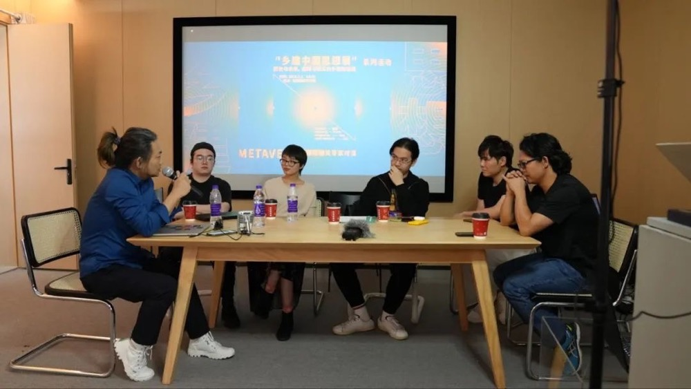

录音整理：黄孙权 翠玉
编 校：翠玉
摄影：翠玉 娄天裕 宋健骅

