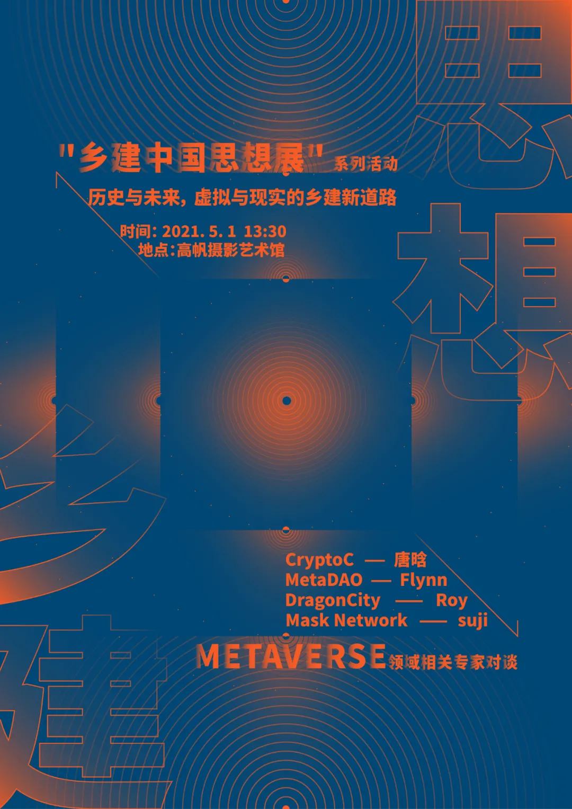
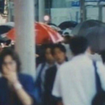
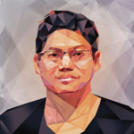
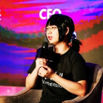

<!--StartFragment-->

由中国美术学院视觉中国协同创新中心空间生产与乡土实践研究组主办的“乡建中国思想展”将于 2021 年 4 月 9 日-5 月 14 日在杭州市萧山区高帆摄影艺术馆暨高帆纪念馆举办。作为国内首次有关乡建思想 ─ 行动的研究性文献展，是空间生产与乡土实践研究组发起的“乡建中国思想史”长期研究计划(2020-至今)的第一阶段呈现，该项目的研究与档案也将以线上资料库的方式持续开放。思想史总是在行动中思考的，是持续的实践知识(phronesis)，乡土中国(From the Soil)是我们的身体流淌的血液与文化基因，一种本源性预设，然我们真实生活的空间是乡建中国(Plot the Soil)，是在城乡中国的空间与社会日与巨变的历程里对未来的筹谋，对生活情节的构造，为了自己与土地而生的设计。这是展览为何是 Plot the Soil 之意。

（乡建中国思想展延期至 2021 年 5 月 14 日）

会议简介

一种乡建实践能既是历史保存也是未来永存档案？将过去的的故事通过现在的人来说给未来的人听？能保留历史的记忆也能保留历史的石头（建筑）吗？这次乡建中国思想展的《北碚》作品，正是这场新革命的开始。我们希望能够透过更多的人的关注与讨论，将陆续邀请人类学家、口述史学者、建筑学者、艺术家、策展人、区块链技术专家、分散式网络实践者、（理论上）永久保存之存储技术企业携手，虚拟世界的创造者一起讨论超越历史于是能够成为未来的新路径，为乡建与虚拟世界、自我与网络、传统学科与新进技术之间建立对话基础，并携手实践出一个非线性的赛博世界。

第一场活动，我们邀请到几个在 metaverse 领域相关的专家，由策展人黄孙权教授主持讨论，分别就自己的实践经验提出想像。

会议流程

题 目

历史与未来，虚拟与现实的乡建新道路

讨 论 会 日 期

2021 年 5 月 1 日（星期六）

会 议 时 间

13:30-14:30 策展人黄孙权现场导览

14:30-16:30 现场讨论会与线上直播

议 程

主持人：黄孙权介绍来宾与论坛主旨议题

嘉宾分享经验：

一、北碚 metadao 小组

二、Dragon City, Metaverse

三、CryptoC

四、Mask

综 合 讨 论

一、乡建与虚拟世界的交织，如何实践出一条自由生长张力的道路？

二、目前的技术困难？

三、如何突破现实的条件？权力之光照映之下方有历史，如何让诸众的历史浮现？亦即，如何突破经济、社会、文化与学术的壁垒与限制？

直播网址

龙门客栈 Dragon Live 直播：

https://dragon.tv

INS 直播：

https://live.bilibili.com/1802589

DCL《北碚》作品中直播：

https://play.decentraland.org/?position=125%2C-44&realm=fenrir-amber

线下参与地点

 杭州市萧山区高帆摄影艺术馆暨高帆纪念馆 

 （湘湖慢生活街 19 号楼）

实践项目与嘉宾介绍

MetaDAO | 幻境小组

幻境小组（MetaDAO) 由幻境实验室（Metaverse Labs）支持，由密码朋克，艺术家，建筑师，程序员，区块链爱好者，游戏爱好者等自发组成的 DAO 组织（去中心化自治组织）。幻境小组的组建基于我们对网络独立宣言，开源文化和密码朋克的思想进行延伸，对虚拟世界与现实世界的交织进行深刻的探索。

幻境小组认为当下世界已经由现实世界和虚拟世界组成，现实世界是指不需要设备或人工技术即可访问的世界，虚拟世界是指需要借助特定设备或技术来访问的世界。姑且以访问途径来区分现实世界与虚拟世界，同时随着技术发展，两个世界的边界正互相渗透甚至边界将变得模糊。

基于对未来人类所栖息的虚拟世界进行探索，幻境小组通过尝试一系列的实验作品来阐述对这个主题的理解。建立小组的目的希望可以吸引到对 Metaverse 主题有兴趣的伙伴进行交流，探讨。我们正通过阅读书籍论文，实验，制作项目的形式进行实践，希望可以作为这个时代的一份子对即将到来的虚拟世界做出贡献。

分享人

幻境实验室开发者，MetaDAO 成员 

 Flynn 

Flynn，MetaDAO（幻境小组）发起者，召集不同专业背景的成员普及 Metaverse 和区块链技术，和小组成员共同进行研究，讨论和项目实践。同时也是 Metaverse Labs(幻境实验室)开发者，从事 Metaverse 相关开发与建设工作。2020 年开始参与龙城建设与运营，在龙城中举办过艺术展览，线上演出，节日庆祝，学术会议等活动。

DragonCity | 龙城

龙城所在的地块，由上百名 Decentraland 虚拟世界社区成员在第一次土地拍卖中进行土地捐赠创立而成。共计 6485 块土地，总面积约 166 万平方米。龙城是一个基于区块链的虚拟城市，作为 Decentraland 中规模庞大的小区，致力于探索有关人类社会未来发展的更多可能性。传统中对于历史的理解是基于线性时间，龙城中的世界架构将抛开这些创造一个过去与现在共存的三维空间甚至多维世界。龙城强调包容性与开放性，在这里不以宗教，种族，国家，性别，阶级作为为区分。每个人都能以任何形式的虚拟化身在龙城中成为真实的自己，进入龙城并受到欢迎。

Metaverse Labs | 幻境实验室

幻境实验室是一个专注于 Metaverse（元宇宙）领域的开发团队，致力于为未来的虚拟世界公民建造一个开放包容的虚拟家园。团队目前在 Decentralnd 虚拟世界平台开发运营龙城社区，同时也正在其他正在兴起的虚拟世界布局和实践。创建 MetaDAO（幻境小组）并提供支持，召集所有对虚拟世界感兴趣的朋友，希望和大家共同创立一个互帮互助的去中心化自治组织，一起向着 Metaverse 世界前进

分享人

 幻境实验室创始人，龙城城主 

 Roy 

Roy，区块链社区早期推动者与建设者，Metaverse Labs(幻境实验室)创始人，同时是 Gödel Labs(哥德尔实验室)的 CEO 和创始人。Metaverse Labs(幻境实验室)成立于 2018 年，是一家致力于建造人类第二家园–The Metaverse 为使命的公司。Metaverse Labs 是区块链 Metaverse 项目 Decentraland 上的 Dragon City(龙城)的造梦者，The Metaverse 基础设施的建设者，NFT 产业如加密艺术的早期推动者。

(https://metaverselabs.com & https://dragoncity.io)

CryptoC

CryptoC 致力于为新时代内容创作者和粉丝建立更好的经济关系，目前已经聚集了许多创作者、粉丝、项目方和投资人，是中国影响力最大的内容 NFT 社区之一。我们运用区块链思维改变传统的内容生产流通过程，降低内容创作者的变现成本，为粉丝提供优质内容。
CryptoC 正在孵化加密艺术画廊“风潮”，聚焦于东方文化、虚拟加密和 Z 时代，是国内首个旨在面向虚拟世界推广中华文化的“画廊”。以“风潮”为先导，CryptoC 成立了风投基金 WaveC，旨在扶持中国内容创作者以及投资新时代内容生产项目。

分享人

 CryptoC 创始人，碳链价值前主编 

 唐晗

唐晗，CryptoC 创始人，碳链价值前主编。从 2019 年初开始追踪报道加密艺术，也是最早将 CryptoPunk 引入国内的媒体人。2020 年发起成立 CryptoC，并在武汉举办加密艺术展。她的理想是服务虚拟世界的文艺工作者。

Mask Network

Mask Network 是一个帮助用户从 Web 2.0 无缝过渡到 Web 3.0 的门户。其提供的主要功能是对信息传输进行加解密，并围绕着这一功能不断发展。Mask Network 倡导用户珍视自己的隐私数据，个人资产并拥有主权。

Mask Network 集去隐私社交，无国界支付网络，去中心化文件存储与分享，去中心化金融，治理（DAO）于一体，帮助用户在 Twitter ，Facebook 等传统社交网络上保护自身的隐私，数据，资产和权利。Mask Network 创建了一个去中心化的应用程序生态系统，为数以万计的用户搭建了一个连接 Web 2.0（现有互联网）和 Web 3.0（新型开放的互联网）的桥梁。

分享人

 Dimension & Mask Network 创始人及 CEO 

 Suji Yan 

Suji Yan，Dimension & Mask Network 创始人及 CEO。从 UIUC（美国伊利诺伊大学香槟分校）计算机工程系辍学创业。前 Qdaily ＆ 财新传媒独立记者，前自动驾驶公司工程师；业余和《激进市场》/ RadicalxChange ，Data Law Group 等经济学者、法律学者等合作撰文；现任 RadicalxChange 基金会导师；曾被《连线》（Wired）、《南华早报》、《华尔街日报》、《纽约时报》等报道。目前个人主要聚焦在开源软件、去中心化互联网以及加密技术等。（公司产品：mask.io / tessercube.com）

 DCL线上展览 

